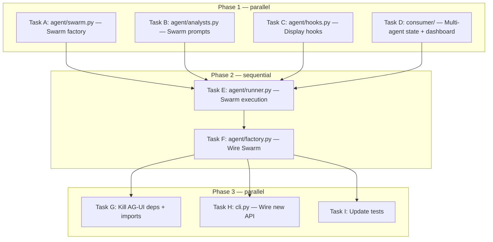

# ERPAVal Plan: v8 Index-first Pipeline with Swarm Specialists

## Architecture Decision Summary

Based on Explore (3 agents) + Research (2 agents), the key facts:

- **Swarm nodes execute sequentially** → safe for shared `_graphs` dict
- **SharedContext is text-only** → injected as text into prompts, no programmatic getter
- **Only final node's structured output matters** → synthesizer gets `AnalysisResult`
- **callback_handler=None on Swarm nodes** → consume via Swarm hooks
- **structlog is GPL-blocked** → stick with loguru (already installed)
- **`code_graph_load` bridges indexer → tools** → load once, all agents use it
- **Strands hooks already used** → extend with SwarmDisplayHook, JsonLogHook
- **CLI flags exist** → `--quiet`, `--output-format json` already wired

## Task Decomposition



### Phase 1: Core Infrastructure (4 parallel tasks)

#### Task A: Create `agent/swarm.py` — Swarm factory

**Objective**: New module that creates the 4-node Swarm with graph preloading.

**Scope**: Create `src/code_context_agent/agent/swarm.py`

**What to build**:
```python
def create_analysis_swarm(
    mode: str = "standard",
    graph_path: Path | None = None,
    hooks: list[HookProvider] | None = None,
) -> Swarm:
```

1. Load pre-built index graph via `code_graph_load("main", graph_path)` if path exists
2. Build graph summary string from `code_graph_stats("main")` for prompt injection
3. Create 4 Agent nodes with focused tool subsets:
   - `structure_analyst` — graph + LSP + AST tools (22 tools)
   - `history_analyst` — git tools (8 tools)
   - `code_reader` — read + search + LSP (6 tools)
   - `synthesizer` — write + graph analysis, `structured_output_model=AnalysisResult`
4. Inject graph summary into each agent's system prompt via `f"...\n{graph_summary}"`
5. Create Swarm with `entry_point=structure_analyst`, `max_handoffs=10`, `execution_timeout=600`, `node_timeout=300`
6. Set `callback_handler=None` on ALL node agents

**Conventions**:
- Import tools inside function (factory.py pattern)
- Use `_create_model()` from analysts.py pattern for BedrockModel
- Return type: `Swarm`

**Success criteria**: `create_analysis_swarm()` returns a Swarm. Can be called with or without a pre-built graph path.

---

#### Task B: Update `agent/analysts.py` — Swarm-aware prompts

**Objective**: Adapt specialist prompts for Swarm handoff pattern.

**Scope**: Modify `src/code_context_agent/agent/analysts.py`

**What to change**:
1. Add handoff instructions to each prompt:
   - Structure analyst: "When done, call `handoff_to_agent('history_analyst', message, context={'structural_hotspots': [...], 'modules': [...]})`"
   - History analyst: "When done, call `handoff_to_agent('code_reader', message, context={'coupling_pairs': [...], 'bus_factor_risks': [...]})`"
   - Code reader: "When done, call `handoff_to_agent('synthesizer', message, context={'invariants': [...], 'risks': [...]})`"
   - Synthesizer: Do NOT hand off — completion signal = no handoff

2. Add graph context injection point to each prompt:
   ```python
   _STRUCTURE_ANALYST_PROMPT_TEMPLATE = """...\n\n## Pre-built Index\n\n{graph_context}\n\nUse `code_graph_load("main", ...)` to access the full graph, then run analysis algorithms on it. Do NOT rebuild the graph from scratch."""
   ```

3. Add `get_specialist_prompt(role: str, graph_context: str) -> str` function

4. Keep `create_analyst_agents()` for backward compat but mark as deprecated

**Success criteria**: Each prompt has handoff instructions and a `{graph_context}` placeholder.

---

#### Task C: Add display hooks to `agent/hooks.py`

**Objective**: HookProvider implementations for TUI and JSON output modes.

**Scope**: Modify `src/code_context_agent/agent/hooks.py`

**What to add**:

1. **`SwarmDisplayHook(HookProvider)`** — multi-agent level events:
   - `BeforeNodeCallEvent` → update DashboardState.active_agent
   - `AfterNodeCallEvent` → mark agent done, record duration
   - `BeforeMultiAgentInvocationEvent` → reset state
   - `AfterMultiAgentInvocationEvent` → finalize

2. **`ToolDisplayHook(HookProvider)`** — per-agent tool events:
   - `BeforeToolCallEvent` → update active_tool in DashboardState
   - `AfterToolCallEvent` → complete tool, extract discoveries

3. **`JsonLogHook(HookProvider)`** — structured JSON lines for --quiet:
   - `BeforeToolCallEvent` → `{"type": "tool_start", "tool": "...", "agent": "..."}`
   - `AfterToolCallEvent` → `{"type": "tool_end", "tool": "...", "duration": ...}`
   - `AfterNodeCallEvent` → `{"type": "agent_done", "agent": "..."}`

4. Update `create_all_hooks()`:
   ```python
   def create_all_hooks(*, full_mode=False, state=None, quiet=False) -> tuple[list[HookProvider], list[HookProvider]]:
       """Returns (agent_hooks, swarm_hooks)."""
   ```

**Dependencies**: Needs `DashboardState` from consumer/state.py (Task D), but can use forward reference or TYPE_CHECKING import.

**Success criteria**: All 3 new hooks instantiate and register callbacks without error.

---

#### Task D: Extend consumer for multi-agent state + dashboard

**Objective**: Update DashboardState and Rich consumer for Swarm multi-agent display.

**Scope**: Modify `consumer/state.py`, `consumer/rich_consumer.py`

**What to change in `state.py`**:
1. Add `SwarmAgentState(StrictModel)`: name, status (waiting/running/done), tool_count, duration, current_tool, findings
2. Add to `AgentDisplayState`: `agents: list[SwarmAgentState]`, `active_agent_name: str | None`
3. Add methods: `set_active_agent(name)`, `complete_agent(name, duration)`, `add_agent_finding(agent, finding)`

**What to change in `rich_consumer.py`**:
1. Replace `Group` + `Panel` layout with `rich.layout.Layout`:
   - Header: timer + progress
   - Left: agent status table (which Swarm agent is active, with Spinner)
   - Right: findings/discoveries
   - Bottom: recent tool calls
2. Keep phase detection and discovery extraction logic
3. The consumer is now driven by hooks mutating state (not by receiving AG-UI events)
4. Add a simple `start_live(state) -> Live` helper and `stop_live(live)` helper

**What to change in `base.py`**:
1. Keep `EventConsumer` ABC temporarily (for backward compat in tests)
2. Add `DashboardState` re-export

**Success criteria**: Rich Layout renders a multi-panel dashboard when state is mutated.

---

### Phase 2: Integration (sequential, depends on all Phase 1 tasks)

#### Task E: Rewrite `agent/runner.py` — Swarm execution

**Objective**: Replace AG-UI event streaming with Swarm execution + hook-based display.

**Scope**: Rewrite `src/code_context_agent/agent/runner.py`

**What to change**:
1. Remove ALL AG-UI imports (`ag_ui.core`, `ag_ui_strands`, `StrandsAgent`)
2. Remove monkey-patch (lines 31-43)
3. Remove `_EVENT_HANDLERS` registry and all `@_register_handler` functions (lines 393-493)
4. Remove `_dispatch_event()` function
5. Simplify `AnalysisContext`: replace `agui_agent: Any` with `swarm: Swarm`, remove `consumer`
6. Rewrite `_setup_analysis_context()`:
   - Call `create_analysis_swarm(mode, graph_path, hooks)` instead of `create_agent()` + `StrandsAgent()`
   - Build hooks via updated `create_all_hooks(state=state, quiet=quiet)`
   - If not quiet: create `DashboardState`, start Rich `Live`
7. Rewrite `_execute_analysis_stream()`:
   - Use `result = await swarm.invoke_async(prompt)` (hooks handle display)
   - Extract `SwarmResult`, get structured output from final node
   - No more event iteration — hooks fire during execution
8. Update `run_analysis()` public API — same signature, new internals
9. Handle turn/duration limits via Swarm's `execution_timeout` + `node_timeout`

**Success criteria**: `run_analysis()` works end-to-end with Swarm, no AG-UI imports.

---

#### Task F: Update `agent/factory.py` — Wire Swarm

**Objective**: Keep `create_agent()` for backward compat (MCP server uses it), add Swarm path.

**Scope**: Modify `src/code_context_agent/agent/factory.py`

**What to change**:
1. Remove sub-agent creation from `create_agent()` (the `if full_mode: create_analyst_agents()` block)
2. `create_agent()` becomes the simple single-agent path (for MCP server, testing)
3. Import `create_analysis_swarm` from `agent/swarm.py` and re-export
4. Remove `strands_tools.graph` import (multi-agent DAG no longer needed)

**Success criteria**: `create_agent()` still works for MCP. `create_analysis_swarm()` importable from factory.

---

### Phase 3: Cleanup (parallel, depends on Phase 2)

#### Task G: Kill AG-UI dependencies

**Objective**: Remove ag-ui-protocol and ag-ui-strands from the project.

**Scope**: `pyproject.toml`, all import sites

**What to do**:
1. `uv remove ag-ui-protocol ag-ui-strands`
2. Grep for any remaining `ag_ui` imports and remove them
3. Update `consumer/base.py` docstring (remove AG-UI references)
4. Delete ADR `docs/adr/0003-ag-ui-event-streaming.md` or mark superseded

**Success criteria**: `uv sync` succeeds, no `ag_ui` in any import.

---

#### Task H: Update `cli.py`

**Objective**: Wire the new runner API, clean up mode handling.

**Scope**: Modify `src/code_context_agent/cli.py`

**What to change**:
1. Update `analyze` command to pass graph_path to `run_analysis()` if index exists
2. Remove consumer creation (hooks handle display now)
3. Loguru setup: `serialize=True` for `--quiet`, suppress for Rich mode
4. Standard mode now uses Swarm too (not just `--full`)

**Success criteria**: `code-context-agent analyze /path` works with Swarm.

---

#### Task I: Update tests

**Objective**: Fix broken tests, add Swarm factory test.

**Scope**: `tests/`

**What to do**:
1. Update `tests/agent/test_runner.py` — test `_build_analysis_prompt` (likely still works)
2. Update `tests/test_hooks.py` — add tests for new hook providers
3. Add `tests/agent/test_swarm.py` — test `create_analysis_swarm()` creates valid Swarm
4. Update `tests/consumer/test_rich_consumer.py` — test multi-agent dashboard rendering
5. Fix any import errors from AG-UI removal
6. Run full `uv run pytest` and fix all failures

**Success criteria**: `uv run pytest` passes, `mise run check` passes.
