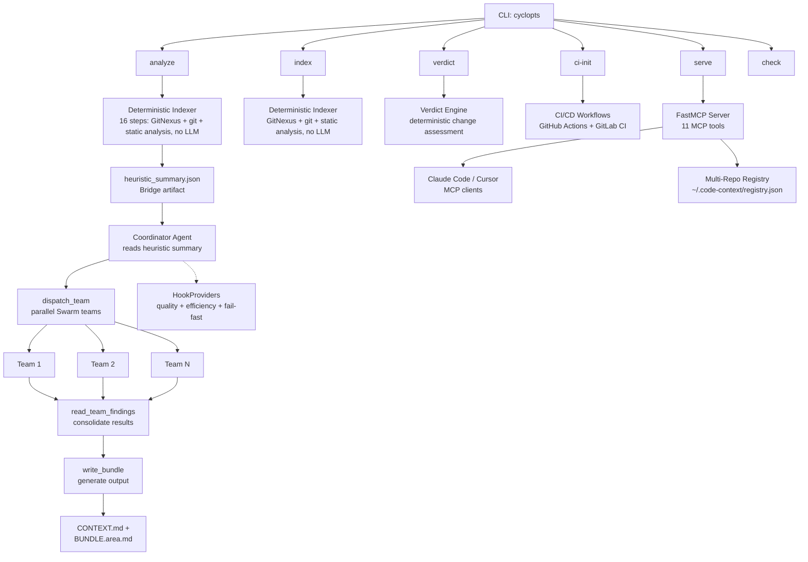

<p align="center">
  
</p>

<p align="center">
  <a href="https://github.com/theagenticguy/code-context-agent/releases"></a>
  <a href="https://www.python.org/downloads/"></a>
  <a href="https://github.com/theagenticguy/code-context-agent/blob/main/LICENSE"></a>
  <a href="https://github.com/theagenticguy/code-context-agent/actions"></a>
  <a href="https://github.com/theagenticguy/code-context-agent"></a>
  <a href="https://github.com/astral-sh/ruff"></a>
  <a href="https://github.com/astral-sh/ty"></a>
</p>

<p align="center"><strong>AI-powered codebase analysis with 27+ tools, GitNexus code intelligence, and structured output for AI coding assistants.</strong></p>

---

# code-context-agent

`code-context-agent` uses Claude Opus 4.6 (via Amazon Bedrock) with 27+ tools to analyze unfamiliar codebases and produce structured context documentation for AI coding assistants. It combines a deterministic indexer, a coordinator agent that dispatches parallel specialist teams, GitNexus code intelligence (Tree-sitter parsing, clustering, process tracing), git history analysis, static analysis (semgrep, radon, vulture, knip), BM25 ranked search, and intelligent code bundling (repomix) to generate narrated markdown that helps developers and AI assistants quickly understand a codebase's architecture and business logic.

> [!CAUTION]
> This CLI runs a **fully autonomous AI agent loop**. The agent decides which tools to invoke, what files to read, and what shell commands to run. While shell commands are restricted to a read-only allowlist and all inputs are validated, the agent makes its own decisions within those bounds. **Review all generated output before using it in production.**

> [!IMPORTANT]
> **Generative AI can make mistakes.** You should review all output and monitor costs generated by your chosen AI model. Analysis of a single repository typically consumes 50K-500K input tokens and 10K-50K output tokens on Claude Opus 4.6. See [AWS Responsible AI Policy](https://aws.amazon.com/machine-learning/responsible-ai/policy/).

> [!NOTE]
> **Disclaimer:** The author is an AWS employee. This is **not** an official AWS project or service. It is not maintained, supported, or endorsed by AWS. This project runs fully autonomous agent loops with access to your filesystem (read-only). You are solely responsible for any consequences of running this tool. The CLI and source code are provided **AS IS** without warranty of any kind. **User discretion advised.**

---

## License

This project is licensed under the [Apache License 2.0](LICENSE).

---

## Tenets

These principles guide every design decision. See [Design Tenets](docs/architecture/tenets.md) for full details with tie-breakers.

1. **Measure, don't guess** -- Rank code by graph metrics (centrality, PageRank, coupling), not by filename or directory structure
2. **Layer signals, read less** -- Combine 5 signal types (AST, call graphs, git history, signatures, commit messages) across all files rather than reading a few files deeply
3. **Compress aggressively, expand selectively** -- Start with the most compressed representation; only expand to full source for code that earns it through high scores
4. **The model picks the depth** -- Analysis depth scales with codebase complexity automatically; no user-facing depth knobs
5. **Machines read it first** -- Output is optimized for AI consumption: typed schemas, ranked tables, bounded diagrams over prose
6. **Fail loud, fill gaps** -- When a signal source is unavailable, surface it explicitly and compensate with remaining signals

---

## Features

- **Claude Opus 4.6** with adaptive thinking and 1M context window
- **27+ analysis tools**: ripgrep, repomix, git history, BM25 search, coordinator orchestration, plus GitNexus MCP and context7 MCP
- **GitNexus code intelligence**: Tree-sitter parsing, symbol clustering, execution flow tracing, blast radius analysis, and Cypher queries via external MCP server
- **Deterministic 16-step indexer**: Builds a heuristic summary without LLM calls using GitNexus, git history, repomix, and static analysis (semgrep, radon, vulture, knip)
- **BM25 ranked search**: TF-IDF-style relevance ranking that complements ripgrep's exact pattern matching
- **Verdict command**: Deterministic change assessment for PRs/diffs with CI/CD exit codes, no LLM calls, runs in under 60 seconds
- **CI/CD integration**: `ci-init` generates GitHub Actions and GitLab CI workflows for nightly analysis, on-merge indexing, and PR verdicts
- **Multi-repo MCP registry**: Track multiple analyzed repositories in `~/.code-context/registry.json` and switch between them from any MCP client
- **Git-aware bundling**: Embeds diffs, commit history, and coupling data directly in context bundles
- **Tree-sitter compression**: Extract signatures/types only, stripping function bodies for token efficiency
- **Structured output**: Pydantic-typed `AnalysisResult` with ranked business logic, risks, and risk profiles
- **`--full` mode**: Exhaustive analysis with no size limits, fail-fast error handling, and extended timeouts
- **Phase-aware TUI**: 5-phase progress tracking with discovery feed and mode badge
- **Rich terminal UI**: Real-time progress display with Rich library
- **MCP server**: Expose analysis pipeline, git evolution, static scan findings, change verdicts, and multi-repo discovery as 11 MCP tools
- **context7 integration**: Library documentation lookup during analysis via MCP
- **Security hardened**: Shell allowlist, input validation on all tool parameters, path traversal prevention, no network access from agent tools

---

## Architecture



### Tool Categories

| Category | Tools | Purpose |
|----------|-------|---------|
| **Coordinator** | `dispatch_team`, `read_team_findings`, `write_bundle`, `read_heuristic_summary`, `score_narrative`, `enrich_bundle` | Team orchestration, finding consolidation, bundle generation |
| **Discovery** | `create_file_manifest`, `repomix_orientation`, `repomix_bundle`, `repomix_compressed_signatures`, `repomix_split_bundle`, `repomix_json_export` | File inventory, bundling, token-aware orientation |
| **Search** | `rg_search`, `read_file_bounded`, `bm25_search` | Exact pattern matching, bounded reading, and BM25 ranked relevance search |
| **Git** | `git_hotspots`, `git_files_changed_together`, `git_blame_summary`, `git_file_history`, `git_contributors`, `git_recent_commits`, `git_diff_file` | Temporal analysis and coupling detection |
| **Shell** | `shell` | Read-only command execution (allowlisted programs only) |
| **GitNexus MCP** | `gitnexus_query`, `gitnexus_context`, `gitnexus_impact`, `gitnexus_detect_changes`, `gitnexus_cypher`, `gitnexus_list_repos` | Structural code intelligence via Tree-sitter |
| **context7 MCP** | `context7_resolve-library-id`, `context7_query-docs` | Live library documentation lookup |

### Security Model

The agent operates under a defense-in-depth security model:

- **Shell allowlist**: Only read-only programs (`ls`, `git log`, `wc`, `head`, `grep`, etc.) are permitted. Destructive commands (`rm`, `mv`, `curl`, `wget`, `docker`, etc.), shell interpreters (`bash`, `sh`), and network tools are blocked.
- **Git read-only**: Git commands are restricted to read-only subcommands (`log`, `diff`, `blame`, `status`, etc.). Write operations (`push`, `commit`, `reset`, `checkout`) are blocked.
- **Shell operator blocking**: Command chaining (`;`, `&&`, `||`, `|`), redirects (`>`, `>>`), backticks, `$()`, and `${}` expansion are all blocked.
- **Input validation**: All tool parameters (`repo_path`, `file_path`, `glob`, `pattern`) are validated before use. Path traversal to sensitive directories (`/etc`, `/root`, `/proc`, `/sys`) is prevented.
- **No `sh -c` string interpolation**: All subprocess calls use list-based execution or stdin piping. No user-controlled values are interpolated into shell command strings.
- **Pinned dependencies**: npm packages invoked at runtime (`context7`) are pinned to major versions.

---

## Prerequisites

### 1. Python Environment

- **Python 3.13+** (required)
- **uv** (Astral's fast package manager)

```bash
curl -LsSf https://astral.sh/uv/install.sh | sh
```

### 2. AWS Configuration

Requires AWS credentials configured for Amazon Bedrock access:

```bash
aws configure
# or set environment variables
export AWS_PROFILE=your-profile
export AWS_REGION=us-east-1
```

Default model: `global.anthropic.claude-opus-4-6-v1` (configurable via `CODE_CONTEXT_MODEL_ID`)

### 3. External CLI Tools

| Tool | Installation | Purpose |
|------|--------------|---------|
| **ripgrep** | `cargo install ripgrep` | File search and manifest creation |
| **gitnexus** | `npm install -g gitnexus` | Structural code intelligence (Tree-sitter parsing, clustering) |
| **repomix** | `npm install -g repomix` | Code bundling with Tree-sitter compression |
| **ty** | `uv tool install ty` | Python type checker (optional, used by indexer) |

---

## Installation

```bash
# Install from package
uv tool install code-context-agent

# Or development setup
git clone https://github.com/theagenticguy/code-context-agent.git
cd code-context-agent
uv sync --all-groups
uv run code-context-agent
```

---

## Usage

### Analyze a Codebase

```bash
# Analyze current directory
code-context-agent analyze .

# Analyze specific repository
code-context-agent analyze /path/to/repo

# Focus on specific area
code-context-agent analyze . --focus "authentication system"

# Issue-focused analysis
code-context-agent analyze . --issue "gh:1694"

# Custom output directory
code-context-agent analyze . --output-dir ./analysis

# Quiet mode
code-context-agent analyze . --quiet

# Debug mode
code-context-agent analyze . --debug

# Generate only bundle files (skip CONTEXT.md)
code-context-agent analyze . --bundles-only

# Incremental analysis since a git ref (accepted but not yet fully implemented)
code-context-agent analyze . --since "2025-01-01"
```

The agent automatically determines analysis depth based on repository size and complexity. Use `--full` for exhaustive analysis.

### 5-Phase Pipeline

The analysis pipeline runs in five phases:

1. **Indexing** -- Deterministic 16-step indexer runs GitNexus + git + static analysis (no LLM)
2. **Team Planning** -- Coordinator agent reads `heuristic_summary.json` and plans specialist teams
3. **Team Execution** -- Parallel Swarm teams run concurrently, each producing `findings.md`
4. **Consolidation** -- Coordinator reads all team findings and cross-references results
5. **Bundle Generation** -- Coordinator writes `CONTEXT.md` and per-area `BUNDLE.{area}.md` files

### Full Mode

```bash
# Exhaustive analysis (no size limits, all graph algorithms, fail-fast)
code-context-agent analyze . --full

# Full + focused on specific area
code-context-agent analyze . --full --focus "authentication"

# Verify external tool dependencies
code-context-agent check
```

### Index (LLM-Free)

Build a deterministic index without any LLM calls -- fast, cheap, and reproducible. Uses GitNexus, git history, repomix, and static analysis tools (semgrep, radon, vulture, knip) to produce artifacts that feed the coordinator agent and verdict engine.

```bash
# Index the current directory
code-context-agent index .

# Index a specific repo with custom output
code-context-agent index /path/to/repo --output-dir ./output

# Quiet mode (errors only)
code-context-agent index . --quiet
```

### MCP Server

Expose the analysis capabilities to coding agents (Claude Code, Cursor, etc.) via the Model Context Protocol:

```bash
# stdio transport (for Claude Desktop, Claude Code)
code-context-agent serve

# HTTP transport (for networked/multi-client access)
code-context-agent serve --transport http --port 8000
```

The MCP server complements GitNexus (structural code intelligence) with capabilities GitNexus does not provide: the full analysis pipeline, git evolution data, static scan findings, change verdicts, and risk trends. Commodity tools (ripgrep, git) are intentionally not exposed since they are already available in every coding agent.

**MCP Tools (11):**
- `start_analysis` / `check_analysis` — kickoff/poll for the full multi-agent analysis pipeline
- `list_repos` — discover all analyzed repositories from the multi-repo registry
- `git_evolution` — hotspot rankings, co-change coupling, contributor breakdown
- `static_scan_findings` — semgrep, typecheck, lint, complexity, and dead code results
- `heuristic_summary` — compact index metrics (volume, health, git, GitNexus)
- `review_classification` — per-area risk levels and review routing recommendations
- `change_verdict` — deterministic PR/diff verdict with CI/CD exit codes
- `consistency_check` — architectural pattern consistency checking
- `risk_trend` — temporal risk trends across multiple analysis runs
- `cross_repo_impact` — detect changes affecting service contracts across repos

All MCP tool responses include **next-step hints** guiding the AI client toward useful follow-up actions.

---

## Output Files

All outputs are written to `.code-context/` (or custom `--output-dir`):

| File | Description |
|------|-------------|
| `CONTEXT.md` | **Main narrated context** (executive summary) |
| `CONTEXT.orientation.md` | Token distribution tree (repomix) |
| `CONTEXT.signatures.md` | Compressed source signatures (Tree-sitter) |
| `files.all.txt` | Complete file manifest |
| `analysis_result.json` | Structured analysis result (Pydantic JSON) |
| `heuristic_summary.json` | Bridge artifact between indexer and coordinator |
| `bundles/BUNDLE.{area}.md` | Targeted narrative bundles per codebase area |
| `tmp/teams/{id}/findings.md` | Per-team analysis findings |
| `git_hotspots.json` | Git churn analysis (top 30 files) |
| `git_cochanges.json` | File co-change coupling data |
| `semgrep_auto.json` | Semgrep auto-config findings |
| `semgrep_owasp.json` | Semgrep OWASP Top Ten findings |
| `typecheck.json` | Type checker output (ty or pyright) |
| `lint.json` | Ruff linter output |
| `complexity.json` | Radon cyclomatic complexity |
| `dead_code_py.json` | Vulture dead code detection (Python) |
| `dead_code_ts.json` | Knip dead code detection (TypeScript/JS) |
| `deps.json` | Dependency tree (pipdeptree or npm) |

---

## Configuration

All configuration uses the `CODE_CONTEXT_` prefix:

| Variable | Default | Description |
|----------|---------|-------------|
| `CODE_CONTEXT_MODEL_ID` | `global.anthropic.claude-opus-4-6-v1` | Bedrock model ID |
| `CODE_CONTEXT_REGION` | `us-east-1` | AWS region |
| `CODE_CONTEXT_TEMPERATURE` | `1.0` | Model temperature (must be 1.0 for thinking) |
| `CODE_CONTEXT_REASONING_EFFORT` | `high` | Standard mode thinking effort |
| `CODE_CONTEXT_FULL_REASONING_EFFORT` | `max` | Full mode thinking effort (Opus 4.6 only) |
| `CODE_CONTEXT_AGENT_MAX_TURNS` | `1000` | Max agent turns (standard mode) |
| `CODE_CONTEXT_AGENT_MAX_DURATION` | `1200` | Timeout in seconds (default: 20 min) |
| `CODE_CONTEXT_FULL_MAX_TURNS` | `3000` | Max agent turns (full mode) |
| `CODE_CONTEXT_FULL_MAX_DURATION` | `3600` | Timeout in seconds for full mode (default: 60 min) |
| `CODE_CONTEXT_GITNEXUS_ENABLED` | `true` | Enable GitNexus MCP for structural code intelligence |
| `CODE_CONTEXT_CONTEXT7_ENABLED` | `true` | Enable context7 MCP for library doc lookup |
| `CODE_CONTEXT_OTEL_DISABLED` | `true` | Disable OpenTelemetry tracing |

---

## Development

| Task | Command |
|------|---------|
| Install dependencies | `uv sync --all-groups` |
| Run CLI | `uv run code-context-agent` |
| Lint | `uvx ruff check src/` |
| Format | `uvx ruff format src/` |
| Type check | `uvx ty check src/` |
| Test | `uv run pytest` |
| Commit (conventional) | `uv run cz commit` |
| Bump version | `uv run cz bump` |

### Project Structure

```
src/code_context_agent/
├── cli.py              # CLI entry point: analyze, index, verdict, ci-init, serve, check
├── config.py           # Configuration (pydantic-settings)
├── indexer.py          # Deterministic 16-step indexer (no LLM)
├── verdict.py          # Deterministic change verdict engine
├── temporal.py         # Risk trend computation across analysis snapshots
├── display.py          # Welcome display and CLI formatting
├── exceptions.py       # Custom exception types
├── agent/              # Agent orchestration
│   ├── factory.py      # Agent creation with tools + MCP providers
│   ├── runner.py       # Analysis runner with hook-based display
│   ├── coordinator.py  # Coordinator agent with parallel team dispatch
│   └── hooks.py        # HookProviders: quality, efficiency, fail-fast
├── mcp/                # FastMCP v3 server (11 tools)
│   ├── server.py       # MCP tools, resources, and server definition
│   └── registry.py     # Multi-repo registry (~/.code-context/registry.json)
├── ci/                 # CI/CD workflow generation (GitHub Actions, GitLab CI)
├── issues/             # Issue provider integration (GitHub)
├── templates/          # Jinja2 prompt templates
│   ├── partials/       # Composable prompt sections
│   └── steering/       # Quality guidance fragments
├── models/             # Pydantic models
│   ├── base.py         # StrictModel, FrozenModel
│   └── output.py       # AnalysisResult, BusinessLogicItem, VerdictResponse, etc.
├── consumer/           # Phase-aware TUI (5 phases + discovery feed)
│   ├── phases.py       # Phase detection, discovery events
│   ├── rich_consumer.py # Dashboard with phase indicator
│   └── state.py        # Mutable display state
├── tools/              # Analysis tools (27+)
│   ├── discovery.py    # ripgrep, repomix, write_file (11 tools)
│   ├── coordinator_tools.py # dispatch_team, read_team_findings, write_bundle (6 tools)
│   ├── git.py          # git history (7 tools)
│   ├── search/         # BM25 ranked search (1 tool)
│   ├── shell_tool.py   # Read-only shell execution (1 tool)
│   └── validation.py   # Input validation for all tool parameters
```

---

## Contributing

Contributions are welcome. Please open an issue or pull request.

- All commits must follow [Conventional Commits](https://www.conventionalcommits.org/) format
- Pre-commit hooks enforce lint, format, type check, and secret scanning
- Pre-push hooks run the full test suite

---

## Related Projects

- [strands-agents](https://github.com/strands-agents/sdk-python) — Agent framework
- [GitNexus](https://www.npmjs.com/package/gitnexus) — Structural code intelligence (Tree-sitter parsing, clustering, process tracing)
- [repomix](https://github.com/yamadashy/repomix) — Code bundling with Tree-sitter
- [ty](https://docs.astral.sh/ty/) — Python type checker
- [rank-bm25](https://github.com/dorianbrown/rank_bm25) — BM25 ranking algorithm
- [FastMCP](https://github.com/jlowin/fastmcp) — Model Context Protocol server framework

---

## License

Copyright 2025 Laith Al-Saadoon

Licensed under the Apache License, Version 2.0. See [LICENSE](LICENSE) for the full text.
