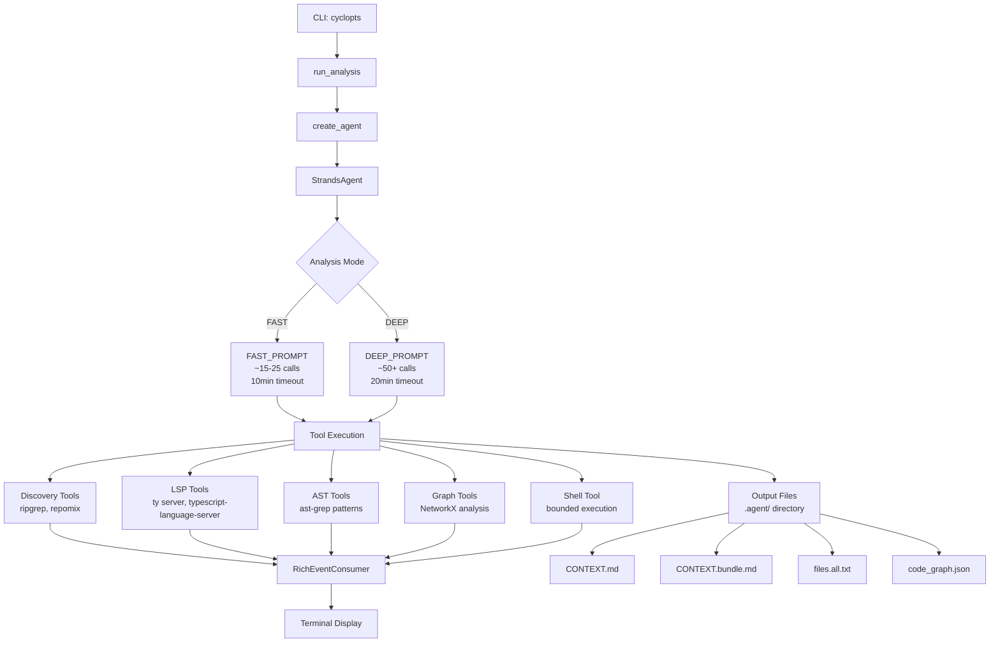

# code-context-agent

**An AI-powered CLI tool for automated codebase analysis and documentation.**

`code-context-agent` uses Claude (via Amazon Bedrock) with a rich toolset to analyze unfamiliar codebases and produce comprehensive context documentation for AI coding assistants. It combines semantic analysis (LSP), structural pattern matching (ast-grep), graph algorithms (NetworkX), and intelligent code bundling (repomix) to generate narrated markdown documentation that helps developers and AI assistants quickly understand a codebase's architecture and business logic.

**Version**: 3.0.3

---

## Features

- **AI-Powered Analysis**: Uses Claude Opus/Sonnet 4.5 with extended thinking (1M context window)
- **Multi-Tool Integration**: Combines LSP, ast-grep, ripgrep, and graph algorithms
- **Two Analysis Modes**:
  - **FAST** (~15-25 tool calls, 10min timeout): Quick overview for getting started safely
  - **DEEP** (~50+ tool calls, 20min timeout): Comprehensive analysis for onboarding/refactoring
- **Graph-Based Insights**: Finds hotspots (betweenness centrality), foundations (PageRank), and modules (Louvain clustering)
- **Business Logic Detection**: Specialized AST patterns for database ops, authentication, state mutations, API routes, etc.
- **Rich Terminal UI**: Real-time progress display with Rich library
- **Structured Output**: Generates narrated CONTEXT.md, code bundles, file manifests, and dependency graphs

---

## Architecture



### Tool Categories

| Category | Tools | Purpose |
|----------|-------|---------|
| **Discovery** | `create_file_manifest`, `repomix_orientation`, `repomix_bundle` | File inventory and bundling |
| **Search** | `rg_search`, `read_file_bounded` | Text search and file reading |
| **LSP** | `lsp_start`, `lsp_document_symbols`, `lsp_references`, `lsp_definition`, `lsp_hover` | Semantic analysis |
| **AST** | `astgrep_scan`, `astgrep_scan_rule_pack`, `astgrep_inline_rule` | Structural pattern matching |
| **Graph** | `code_graph_create`, `code_graph_hotspots`, `code_graph_foundations`, `code_graph_modules` | Dependency and structural analysis |
| **Shell** | `shell` | Bounded command execution |

---

## Prerequisites

### 1. Python Environment

- **Python 3.13+** (required)
- **uv** (Astral's fast package manager)

Install `uv`:
```bash
curl -LsSf https://astral.sh/uv/install.sh | sh
```

### 2. AWS Configuration

Requires AWS credentials configured for Amazon Bedrock access:

```bash
aws configure
# or set environment variables
export AWS_PROFILE=your-profile
export AWS_REGION=us-east-1
```

Default model: `global.anthropic.claude-sonnet-4-5-20250929-v1:0` (configurable)

### 3. External CLI Tools

These tools must be installed and available in your `PATH`:

| Tool | Installation | Purpose |
|------|--------------|---------|
| **ripgrep** | `cargo install ripgrep` or system package manager | File search and manifest creation |
| **ast-grep** | `cargo install ast-grep` | Structural code search |
| **repomix** | `npm install -g repomix` | Code bundling |
| **typescript-language-server** | `npm install -g typescript-language-server` | TypeScript/JavaScript LSP |
| **ty** | `uv tool install ty` | Python type checker/LSP server |

#### Quick install (all external tools):

```bash
# Rust tools (requires cargo)
cargo install ripgrep ast-grep

# Node.js tools (requires npm)
npm install -g repomix typescript-language-server

# Python tools (requires uv)
uv tool install ty
```

---

## Installation

### Option 1: Install from Package

```bash
uv tool install code-context-agent
```

### Option 2: Development Setup

```bash
# Clone repository
git clone <repository-url>
cd code-context-agent

# Install all dependencies (including dev tools)
uv sync --all-groups

# Run CLI
uv run code-context-agent
```

### Option 3: Build from Source

```bash
# Build the package
uv build

# Install the built wheel
uv tool install dist/code_context_agent-*.whl
```

---

## Usage

### Basic Analysis

```bash
# Show welcome and configuration
code-context-agent

# Analyze current directory (FAST mode)
code-context-agent analyze .

# Analyze specific repository
code-context-agent analyze /path/to/repo

# Deep analysis (comprehensive)
code-context-agent analyze . --deep

# Focus on specific area
code-context-agent analyze . --focus "authentication system"

# Custom output directory
code-context-agent analyze . --output-dir ./analysis

# Quiet mode (minimal output)
code-context-agent analyze . --quiet

# Debug mode (verbose logging)
code-context-agent analyze . --debug

# Disable steering (progressive disclosure)
code-context-agent analyze . --no-steering
```

### Analysis Modes

| Mode | Tool Calls | Timeout | Use Case |
|------|------------|---------|----------|
| **FAST** | ~15-25 | 10 min | Quick overview for starting work safely |
| **DEEP** | ~50+ | 20 min | Comprehensive analysis for onboarding/refactoring |

**FAST Mode** (default):
- Quick orientation
- Minimal LSP usage
- 5-15 business logic candidates
- Essential graph metrics

**DEEP Mode** (`--deep` flag):
- Full dependency cones
- 20-50 business logic candidates
- Comprehensive graph analysis
- Detailed file index

---

## Output Files

All outputs are written to the `.agent/` directory (or custom `--output-dir`):

| File | Description | Mode |
|------|-------------|------|
| `files.all.txt` | Complete file manifest (respects .gitignore) | Both |
| `files.business.txt` | Curated business logic files | Both |
| `CONTEXT.orientation.md` | Token distribution tree from repomix | Both |
| `CONTEXT.bundle.md` | Bundled source code | Both |
| `CONTEXT.md` | **Main narrated context** (≤300 lines) | Both |
| `FILE_INDEX.md` | Detailed file index (≤400 lines) | DEEP |
| `CONTEXT.business.*.md` | Category-specific breakdowns | DEEP |
| `code_graph.json` | Persisted graph data | DEEP |

### Main Output: CONTEXT.md

The primary output is a narrated markdown document that includes:

- **Architecture Overview**: High-level structure and patterns
- **Business Logic**: Critical code paths and domain operations
- **Entry Points**: Main execution starting points
- **Dependencies**: Key libraries and their purposes
- **Hotspots**: Bottleneck code (high betweenness centrality)
- **Foundations**: Core infrastructure (high PageRank)
- **Modules**: Logical groupings (Louvain clustering)

---

## Configuration

### Environment Variables

All configuration uses the `CODE_CONTEXT_` prefix:

| Variable | Default | Description |
|----------|---------|-------------|
| `CODE_CONTEXT_MODEL_ID` | `global.anthropic.claude-sonnet-4-5-20250929-v1:0` | Bedrock model ID |
| `CODE_CONTEXT_REGION` | `us-east-1` | AWS region |
| `CODE_CONTEXT_TEMPERATURE` | `1.0` | Model temperature (must be 1.0 for extended thinking) |
| `CODE_CONTEXT_LSP_TIMEOUT` | `30` | LSP operation timeout (seconds) |
| `CODE_CONTEXT_LSP_STARTUP_TIMEOUT` | `30` | LSP server initialization timeout |
| `CODE_CONTEXT_AGENT_MAX_TURNS` | `1000` | Max agent turns |
| `CODE_CONTEXT_AGENT_MAX_DURATION` | `600` | FAST mode timeout (seconds) |
| `CODE_CONTEXT_DEEP_MODE_MAX_DURATION` | `1200` | DEEP mode timeout (seconds) |
| `CODE_CONTEXT_OTEL_DISABLED` | `true` | Disable OpenTelemetry tracing |

### Example Configuration

```bash
# Use Claude Opus for more thorough analysis
export CODE_CONTEXT_MODEL_ID="global.anthropic.claude-opus-4-20250514-v1:0"

# Increase timeout for large codebases
export CODE_CONTEXT_DEEP_MODE_MAX_DURATION=1800

# Different AWS region
export CODE_CONTEXT_REGION=us-west-2

# Run analysis
code-context-agent analyze . --deep
```

---

## Development

### Quick Reference

| Task | Command |
|------|---------|
| Install dependencies | `uv sync --all-groups` |
| Run CLI | `uv run code-context-agent` |
| Lint | `uv run ruff check src/` |
| Format | `uv run ruff format src/` |
| Type check | `uv run ty check src/` |
| Test | `uv run pytest` |
| Test (parallel) | `uv run pytest -n auto` |
| Security scan | `uv run bandit -r src/` |
| Audit dependencies | `uv run pip-audit` |
| Commit (conventional) | `uv run cz commit` |
| Bump version | `uv run cz bump` |
| Build package | `uv build` |

### Project Structure

```
src/code_context_agent/
├── cli.py              # CLI entry point (cyclopts)
├── config.py           # Configuration (pydantic-settings)
├── agent/              # Agent orchestration
│   ├── factory.py      # Agent creation with tools
│   ├── runner.py       # Analysis runner
│   ├── sop.py          # System prompts (FAST/DEEP)
│   └── steering.py     # Progressive disclosure
├── consumer/           # Event display
│   └── rich_consumer.py
├── tools/              # Analysis tools (30+)
│   ├── discovery.py    # ripgrep, repomix
│   ├── astgrep.py      # ast-grep
│   ├── shell_tool.py   # shell command execution
│   ├── lsp/            # LSP integration
│   │   ├── client.py
│   │   ├── session.py
│   │   └── tools.py
│   └── graph/          # Graph analysis (NetworkX)
│       ├── model.py
│       ├── analysis.py
│       └── tools.py
└── rules/              # ast-grep rule packs
    ├── py_business_logic.yml
    └── ts_business_logic.yml
```

### Tech Stack

| Component | Technology | Purpose |
|-----------|-----------|---------|
| **Agent Framework** | strands-agents | Amazon's agent orchestration |
| **CLI** | cyclopts | Modern CLI framework |
| **Logging** | loguru | Structured colored logging |
| **Terminal UI** | rich | Progress display and formatting |
| **Data Validation** | pydantic | Settings and models |
| **Graph Analysis** | networkx | Dependency graphs |
| **Code Quality** | ruff | Linting and formatting |
| **Type Checking** | ty | Fast Python type checker |
| **Testing** | pytest | Test framework |
| **Commits** | commitizen | Conventional commits |

### Pre-commit Validation

```bash
# Run all checks before committing
uv run ruff check src/ --fix && \
uv run ruff format src/ && \
uv run ty check src/ && \
uv run pytest
```

### Conventional Commits

Uses [Conventional Commits](https://www.conventionalcommits.org/) for automatic versioning:

- `feat:` → MINOR bump
- `fix:` → PATCH bump
- `BREAKING CHANGE:` → MAJOR bump

```bash
# Interactive commit
uv run cz commit

# Auto-bump version
uv run cz bump
```

---

## Business Logic Detection

The tool uses ast-grep rule packs to find domain-critical code:

### Python Patterns (`py_business_logic.yml`)

- Database operations (SQLAlchemy, Django ORM, raw SQL)
- Authentication (decorators, permission checks)
- State mutations (status field changes, transitions)
- HTTP operations (requests, httpx, aiohttp)
- API routes (FastAPI, Flask, Django views)
- Background tasks (Celery)
- Event handling (signals, message publishing)

### TypeScript Patterns (`ts_business_logic.yml`)

- Database queries (Prisma, TypeORM, Sequelize)
- Auth middleware (JWT, session checks)
- State mutations (setState, updates)
- HTTP calls (fetch, axios)
- API routes (Express, Next.js)
- Event handlers (WebSocket, message queues)

### Severity Levels

- **error**: Write operations, mutations (highest priority)
- **warning**: Read operations, queries
- **hint**: Schema/model definitions

---

## Troubleshooting

### Common Issues

#### 1. "rg not found" or "ast-grep not found"

**Solution**: Install missing CLI tools (see [Prerequisites](#3-external-cli-tools))

```bash
cargo install ripgrep ast-grep
npm install -g repomix typescript-language-server
uv tool install ty
```

#### 2. "AWS credentials not configured"

**Solution**: Configure AWS credentials for Bedrock access

```bash
aws configure
# or
export AWS_PROFILE=your-profile
```

#### 3. LSP timeout errors

**Solution**: Increase LSP timeouts for large projects

```bash
export CODE_CONTEXT_LSP_TIMEOUT=60
export CODE_CONTEXT_LSP_STARTUP_TIMEOUT=60
```

#### 4. Agent timeout (analysis incomplete)

**Solution**: Use FAST mode or increase timeout

```bash
# Use FAST mode for quick analysis
code-context-agent analyze .

# Or increase timeout for DEEP mode
export CODE_CONTEXT_DEEP_MODE_MAX_DURATION=1800
code-context-agent analyze . --deep
```

#### 5. Empty or minimal output

**Possible causes**:
- Repository has no matching files (check `.gitignore`)
- LSP server failed to start (check `--debug` output)
- AWS credentials expired
- Model timeout

**Solution**: Run with `--debug` to see detailed logs

```bash
code-context-agent analyze . --debug
```

#### 6. "ty server" not found

**Solution**: Ensure `ty` is installed and in PATH

```bash
# Install ty
uv tool install ty

# Verify installation
ty --version

# Check PATH
which ty
```

---

## Advanced Usage

### Custom Focus Areas

Use the `--focus` flag to guide the agent's attention:

```bash
# Focus on authentication
code-context-agent analyze . --focus "authentication and authorization"

# Focus on API layer
code-context-agent analyze . --focus "REST API endpoints and GraphQL resolvers"

# Focus on data layer
code-context-agent analyze . --focus "database models and migrations"
```

### Using Output with AI Assistants

The generated `CONTEXT.md` is designed to be used with AI coding assistants:

```bash
# Generate context
code-context-agent analyze /path/to/repo --deep

# Use with Claude, ChatGPT, or other AI assistants
cat .agent/CONTEXT.md | pbcopy  # macOS
cat .agent/CONTEXT.md | xclip   # Linux
```

Then paste the context into your AI assistant along with your question.

### Graph Analysis Output

In DEEP mode, the tool generates `code_graph.json` containing:

- **Nodes**: Files with metadata (tokens, type, etc.)
- **Edges**: Dependencies with weights
- **Metrics**: Centrality, PageRank, clustering coefficients
- **Communities**: Detected modules via Louvain algorithm

You can load this graph for custom analysis:

```python
import json
import networkx as nx

# Load graph
with open(".agent/code_graph.json") as f:
    data = json.load(f)

# Reconstruct NetworkX graph
G = nx.node_link_graph(data)

# Custom analysis
betweenness = nx.betweenness_centrality(G)
pagerank = nx.pagerank(G)
```

---

## Contributing

1. Fork the repository
2. Create a feature branch
3. Make your changes
4. Run validation: `uv run ruff check src/ --fix && uv run ty check src/ && uv run pytest`
5. Commit using conventional commits: `uv run cz commit`
6. Submit a pull request

---

## License

See [LICENSE](LICENSE) file for details.

---

## Related Projects

- [strands-agents](https://github.com/awslabs/strands-agents) - Amazon's agent framework
- [ast-grep](https://ast-grep.github.io/) - Structural code search tool
- [repomix](https://github.com/yamadashy/repomix) - Code bundling tool
- [ty](https://docs.astral.sh/ty/) - Astral's Python type checker
- [uv](https://docs.astral.sh/uv/) - Astral's Python package manager

---

## Support

- **Issues**: Report bugs and feature requests at the repository issue tracker
- **Documentation**: See [AGENTS.md](AGENTS.md) for developer tools guide
- **Changelog**: See [CHANGELOG.md](CHANGELOG.md) for version history
