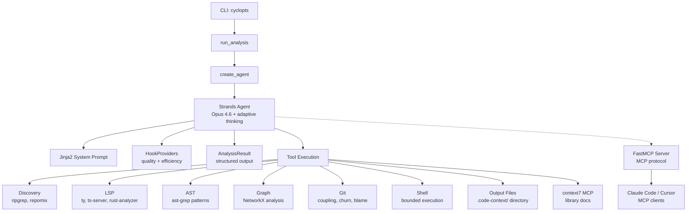

# code-context-agent

**An AI-powered CLI tool for automated codebase analysis and context generation.**

`code-context-agent` uses Claude Opus 4.6 (via Amazon Bedrock) with 40+ tools to analyze unfamiliar codebases and produce structured context documentation for AI coding assistants. It combines semantic analysis (LSP), structural pattern matching (ast-grep), graph algorithms (NetworkX), git history analysis, and intelligent code bundling (repomix) to generate narrated markdown that helps developers and AI assistants quickly understand a codebase's architecture and business logic.

---

## Tenets

These principles guide every design decision. See [tenets.md](tenets.md) for full details with tie-breakers.

1. **Measure, don't guess** — Rank code by graph metrics (centrality, PageRank, coupling), not by filename or directory structure
2. **Layer signals, read less** — Combine 5 signal types (AST, call graphs, git history, signatures, commit messages) across all files rather than reading a few files deeply
3. **Compress aggressively, expand selectively** — Start with the most compressed representation; only expand to full source for code that earns it through high scores
4. **The model picks the depth** — Analysis depth scales with codebase complexity automatically; no user-facing depth knobs
5. **Machines read it first** — Output is optimized for AI consumption: typed schemas, ranked tables, bounded diagrams over prose
6. **Fail loud, fill gaps** — When a signal source is unavailable, surface it explicitly and compensate with remaining signals

---

## Features

- **Claude Opus 4.6** with adaptive thinking and 1M context window
- **40+ analysis tools**: LSP, ast-grep, ripgrep, repomix, git history, NetworkX graph
- **Multi-language LSP**: Python (ty), TypeScript, Rust, Go, Java (configurable)
- **Graph-based insights**: Hotspots (betweenness centrality), foundations (PageRank/TrustRank), modules (Louvain/Leiden), triangle detection
- **Git-aware bundling**: Embeds diffs, commit history, and coupling data directly in context bundles
- **Tree-sitter compression**: Extract signatures/types only, stripping function bodies for token efficiency
- **Structured output**: Pydantic-typed `AnalysisResult` with ranked business logic, risks, and graph stats
- **Rich terminal UI**: Real-time progress display with Rich library
- **MCP server**: Expose graph algorithms and analysis as MCP tools for Claude Code, Cursor, and other agents
- **context7 integration**: Library documentation lookup during analysis via MCP

---

## Architecture



### Tool Categories

| Category | Tools | Purpose |
|----------|-------|---------|
| **Discovery** | `create_file_manifest`, `repomix_orientation`, `repomix_bundle`, `repomix_compressed_signatures`, `repomix_split_bundle`, `repomix_json_export` | File inventory, bundling, token-aware orientation |
| **Search** | `rg_search`, `read_file_bounded` | Text search and bounded file reading |
| **LSP** | `lsp_start`, `lsp_document_symbols`, `lsp_references`, `lsp_definition`, `lsp_hover`, `lsp_workspace_symbols`, `lsp_diagnostics` | Semantic analysis across multiple languages |
| **AST** | `astgrep_scan`, `astgrep_scan_rule_pack`, `astgrep_inline_rule` | Structural pattern matching |
| **Graph** | `code_graph_create`, `code_graph_analyze` (hotspots, foundations, trust, modules, triangles, coupling), `code_graph_explore`, `code_graph_export` | Dependency and structural analysis |
| **Git** | `git_hotspots`, `git_files_changed_together`, `git_blame_summary`, `git_file_history`, `git_contributors`, `git_recent_commits`, `git_diff_file` | Temporal analysis and coupling detection |
| **Shell** | `shell` | Bounded command execution |

---

## Prerequisites

### 1. Python Environment

- **Python 3.13+** (required)
- **uv** (Astral's fast package manager)

```bash
curl -LsSf https://astral.sh/uv/install.sh | sh
```

### 2. AWS Configuration

Requires AWS credentials configured for Amazon Bedrock access:

```bash
aws configure
# or set environment variables
export AWS_PROFILE=your-profile
export AWS_REGION=us-east-1
```

Default model: `global.anthropic.claude-opus-4-6-v1` (configurable via `CODE_CONTEXT_MODEL_ID`)

### 3. External CLI Tools

| Tool | Installation | Purpose |
|------|--------------|---------|
| **ripgrep** | `cargo install ripgrep` | File search and manifest creation |
| **ast-grep** | `cargo install ast-grep` | Structural code search |
| **repomix** | `npm install -g repomix` | Code bundling with Tree-sitter compression |
| **typescript-language-server** | `npm install -g typescript-language-server` | TypeScript/JavaScript LSP |
| **ty** | `uv tool install ty` | Python type checker/LSP server |

---

## Installation

```bash
# Install from package
uv tool install code-context-agent

# Or development setup
git clone <repository-url>
cd code-context-agent
uv sync --all-groups
uv run code-context-agent
```

---

## Usage

### Analyze a Codebase

```bash
# Analyze current directory
code-context-agent analyze .

# Analyze specific repository
code-context-agent analyze /path/to/repo

# Focus on specific area
code-context-agent analyze . --focus "authentication system"

# Issue-focused analysis
code-context-agent analyze . --issue "gh:1694"

# Custom output directory
code-context-agent analyze . --output-dir ./analysis

# Quiet mode
code-context-agent analyze . --quiet

# Debug mode
code-context-agent analyze . --debug
```

The agent automatically determines analysis depth based on repository size and complexity. No mode flags needed.

### MCP Server

Expose the analysis capabilities to coding agents (Claude Code, Cursor, etc.) via the Model Context Protocol:

```bash
# stdio transport (for Claude Desktop, Claude Code)
code-context-agent serve

# HTTP transport (for networked/multi-client access)
code-context-agent serve --transport http --port 8000
```

The MCP server exposes the core differentiators — graph algorithms, progressive exploration, and the full analysis pipeline — as tools that any MCP client can use. Commodity tools (ripgrep, LSP, git) are intentionally not exposed since they're already available in every coding agent.

**MCP Tools:**
- `start_analysis` / `check_analysis` — kickoff/poll for the full analysis pipeline
- `query_code_graph` — run algorithms (PageRank, betweenness centrality, Louvain community detection, etc.)
- `explore_code_graph` — progressive drill-down into graph structure
- `get_graph_stats` — graph composition summary

### Visualize Results

```bash
# Launch interactive web visualization
code-context-agent viz .
```

---

## Output Files

All outputs are written to `.code-context/` (or custom `--output-dir`):

| File | Description |
|------|-------------|
| `CONTEXT.md` | **Main narrated context** (≤300 lines) |
| `CONTEXT.orientation.md` | Token distribution tree |
| `CONTEXT.bundle.md` | Bundled source code (compressed) |
| `CONTEXT.signatures.md` | Signatures-only structural view |
| `files.all.txt` | Complete file manifest |
| `files.business.txt` | Curated business logic files |
| `code_graph.json` | Persisted graph data |
| `FILE_INDEX.md` | File index with graph metrics (complex repos) |

---

## Configuration

All configuration uses the `CODE_CONTEXT_` prefix:

| Variable | Default | Description |
|----------|---------|-------------|
| `CODE_CONTEXT_MODEL_ID` | `global.anthropic.claude-opus-4-6-v1` | Bedrock model ID |
| `CODE_CONTEXT_REGION` | `us-east-1` | AWS region |
| `CODE_CONTEXT_TEMPERATURE` | `1.0` | Model temperature (must be 1.0 for thinking) |
| `CODE_CONTEXT_LSP_SERVERS` | `{"ts": "typescript-language-server --stdio", "py": "ty server", ...}` | LSP server registry (JSON) |
| `CODE_CONTEXT_AGENT_MAX_TURNS` | `1000` | Max agent turns |
| `CODE_CONTEXT_AGENT_MAX_DURATION` | `1200` | Timeout in seconds (default: 20 min) |
| `CODE_CONTEXT_CONTEXT7_ENABLED` | `true` | Enable context7 MCP for library doc lookup |

---

## Development

| Task | Command |
|------|---------|
| Install dependencies | `uv sync --all-groups` |
| Run CLI | `uv run code-context-agent` |
| Lint | `uvx ruff check src/` |
| Format | `uvx ruff format src/` |
| Type check | `uvx ty check src/` |
| Test | `uv run pytest` |
| Commit (conventional) | `uv run cz commit` |
| Bump version | `uv run cz bump` |

### Project Structure

```
src/code_context_agent/
├── cli.py              # CLI entry point (cyclopts)
├── config.py           # Configuration (pydantic-settings)
├── agent/              # Agent orchestration
│   ├── factory.py      # Agent creation with tools + MCP providers
│   ├── runner.py       # Analysis runner with event streaming
│   ├── prompts.py      # Jinja2 template rendering
│   └── hooks.py        # HookProvider for quality/efficiency
├── mcp/                # FastMCP v3 server
│   ├── __init__.py     # Package init
│   └── server.py       # MCP tools, resources, and server definition
├── templates/          # Jinja2 prompt templates
│   ├── system.md.j2    # Unified system prompt
│   ├── partials/       # Composable prompt sections
│   └── steering/       # Quality guidance fragments
├── models/             # Pydantic models
│   ├── base.py         # StrictModel, FrozenModel
│   └── output.py       # AnalysisResult, BusinessLogicItem, etc.
├── consumer/           # Event display (Rich TUI)
├── tools/              # Analysis tools (40+)
│   ├── discovery.py    # ripgrep, repomix (6 tools)
│   ├── astgrep.py      # ast-grep (3 tools)
│   ├── git.py          # git history (7 tools)
│   ├── lsp/            # LSP integration (8 tools)
│   └── graph/          # NetworkX analysis (12 tools)
└── rules/              # ast-grep rule packs
```

---

## License

See [LICENSE](LICENSE) file for details.

---

## Related Projects

- [strands-agents](https://github.com/strands-agents/sdk-python) — Agent framework
- [ast-grep](https://ast-grep.github.io/) — Structural code search
- [repomix](https://github.com/yamadashy/repomix) — Code bundling with Tree-sitter
- [ty](https://docs.astral.sh/ty/) — Python type checker/LSP server
- [NetworkX](https://networkx.org/) — Graph algorithms
