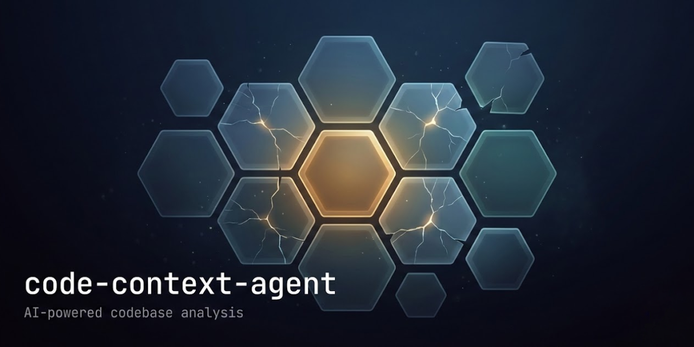
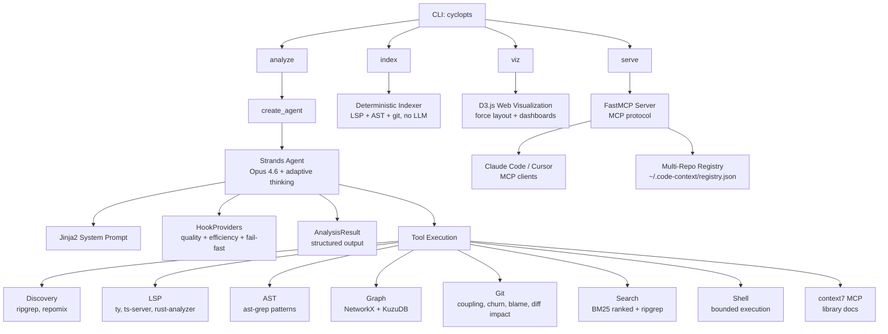

<p align="center">
  
</p>

<p align="center">
  <a href="https://github.com/theagenticguy/code-context-agent/releases"></a>
  <a href="https://www.python.org/downloads/"></a>
  <a href="https://github.com/theagenticguy/code-context-agent/blob/main/LICENSE"></a>
  <a href="https://github.com/theagenticguy/code-context-agent/actions"></a>
  <a href="https://github.com/theagenticguy/code-context-agent"></a>
  <a href="https://github.com/astral-sh/ruff"></a>
  <a href="https://github.com/astral-sh/ty"></a>
</p>

<p align="center"><strong>AI-powered codebase analysis with 49 tools, graph algorithms, and structured output for AI coding assistants.</strong></p>

---

# code-context-agent

`code-context-agent` uses Claude Opus 4.6 (via Amazon Bedrock) with 49 tools to analyze unfamiliar codebases and produce structured context documentation for AI coding assistants. It combines semantic analysis (LSP), structural pattern matching (ast-grep), graph algorithms (NetworkX + KuzuDB), git history analysis, BM25 ranked search, and intelligent code bundling (repomix) to generate narrated markdown that helps developers and AI assistants quickly understand a codebase's architecture and business logic.

> [!CAUTION]
> This CLI runs a **fully autonomous AI agent loop**. The agent decides which tools to invoke, what files to read, and what shell commands to run. While shell commands are restricted to a read-only allowlist and all inputs are validated, the agent makes its own decisions within those bounds. **Review all generated output before using it in production.**

> [!IMPORTANT]
> **Generative AI can make mistakes.** You should review all output and monitor costs generated by your chosen AI model. Analysis of a single repository typically consumes 50K-500K input tokens and 10K-50K output tokens on Claude Opus 4.6. See [AWS Responsible AI Policy](https://aws.amazon.com/machine-learning/responsible-ai/policy/).

> [!NOTE]
> **Disclaimer:** The author is an AWS employee. This is **not** an official AWS project or service. It is not maintained, supported, or endorsed by AWS. This project runs fully autonomous agent loops with access to your filesystem (read-only). You are solely responsible for any consequences of running this tool. The CLI and source code are provided **AS IS** without warranty of any kind. **User discretion advised.**

---

## License

This project is licensed under the [Apache License 2.0](LICENSE).

---

## Tenets

These principles guide every design decision. See [tenets.md](tenets.md) for full details with tie-breakers.

1. **Measure, don't guess** -- Rank code by graph metrics (centrality, PageRank, coupling), not by filename or directory structure
2. **Layer signals, read less** -- Combine 5 signal types (AST, call graphs, git history, signatures, commit messages) across all files rather than reading a few files deeply
3. **Compress aggressively, expand selectively** -- Start with the most compressed representation; only expand to full source for code that earns it through high scores
4. **The model picks the depth** -- Analysis depth scales with codebase complexity automatically; no user-facing depth knobs
5. **Machines read it first** -- Output is optimized for AI consumption: typed schemas, ranked tables, bounded diagrams over prose
6. **Fail loud, fill gaps** -- When a signal source is unavailable, surface it explicitly and compensate with remaining signals

---

## Features

- **Claude Opus 4.6** with adaptive thinking and 1M context window
- **49 analysis tools**: LSP, ast-grep, ripgrep, repomix, git history, NetworkX graph, BM25 search
- **Multi-language LSP**: Python (ty), TypeScript, Rust, Go, Java (configurable fallback chains)
- **Graph-based insights**: Hotspots, foundations (PageRank/TrustRank), modules (Louvain/Leiden), blast radius analysis, execution flow tracing, diff impact mapping
- **Edge confidence scoring**: Each graph edge carries a confidence value (0.60--0.95) reflecting its data source reliability (LSP, AST, git, heuristic)
- **BM25 ranked search**: TF-IDF-style relevance ranking that complements ripgrep's exact pattern matching
- **Framework detection**: Automatically identifies Next.js, Express, Django, Flask, FastAPI, pytest, and CLI frameworks to boost entry point scoring
- **KuzuDB persistent backend**: Optionally persist the code graph to a KuzuDB database for Cypher queries and cross-session reuse
- **Deterministic indexing**: `code-context-agent index` builds a code graph without LLM calls -- fast, cheap, and reproducible
- **Git diff impact analysis**: Map changed lines to affected symbols, propagate blast radius, and suggest tests
- **Multi-repo MCP registry**: Track multiple analyzed repositories in `~/.code-context/registry.json` and switch between them from any MCP client
- **Interactive D3.js visualization**: Web-based graph explorer with force layout, hotspot charts, module views, and dashboard metrics
- **Git-aware bundling**: Embeds diffs, commit history, and coupling data directly in context bundles
- **Tree-sitter compression**: Extract signatures/types only, stripping function bodies for token efficiency
- **Structured output**: Pydantic-typed `AnalysisResult` with ranked business logic, risks, and graph stats
- **`--full` mode**: Exhaustive analysis with no size limits, fail-fast error handling, and per-module output
- **Phase-aware TUI**: 10-phase progress tracking with discovery feed and mode badge
- **Rich terminal UI**: Real-time progress display with Rich library
- **MCP server**: Expose graph algorithms, diff impact, Cypher queries, and multi-repo discovery as MCP tools
- **context7 integration**: Library documentation lookup during analysis via MCP
- **Security hardened**: Shell allowlist, input validation on all tool parameters, path traversal prevention, no network access from agent tools

---

## Architecture



### Tool Categories

| Category | Tools | Purpose |
|----------|-------|---------|
| **Discovery** | `create_file_manifest`, `repomix_orientation`, `repomix_bundle`, `repomix_compressed_signatures`, `repomix_split_bundle`, `repomix_json_export` | File inventory, bundling, token-aware orientation |
| **Search** | `rg_search`, `read_file_bounded`, `bm25_search` | Exact pattern matching, bounded reading, and BM25 ranked relevance search |
| **LSP** | `lsp_start`, `lsp_document_symbols`, `lsp_references`, `lsp_definition`, `lsp_hover`, `lsp_workspace_symbols`, `lsp_diagnostics` | Semantic analysis across multiple languages |
| **AST** | `astgrep_scan`, `astgrep_scan_rule_pack`, `astgrep_inline_rule` | Structural pattern matching |
| **Graph** | `code_graph_create`, `code_graph_analyze` (hotspots, foundations, trust, modules, triangles, coupling, blast radius, execution flows, diff impact), `code_graph_explore`, `code_graph_export` | Dependency analysis, impact propagation, execution flow tracing |
| **Git** | `git_hotspots`, `git_files_changed_together`, `git_blame_summary`, `git_file_history`, `git_contributors`, `git_recent_commits`, `git_diff_file` | Temporal analysis and coupling detection |
| **Shell** | `shell` | Read-only command execution (allowlisted programs only) |

### Security Model

The agent operates under a defense-in-depth security model:

- **Shell allowlist**: Only read-only programs (`ls`, `git log`, `wc`, `head`, `grep`, etc.) are permitted. Destructive commands (`rm`, `mv`, `curl`, `wget`, `docker`, etc.), shell interpreters (`bash`, `sh`), and network tools are blocked.
- **Git read-only**: Git commands are restricted to read-only subcommands (`log`, `diff`, `blame`, `status`, etc.). Write operations (`push`, `commit`, `reset`, `checkout`) are blocked.
- **Shell operator blocking**: Command chaining (`;`, `&&`, `||`, `|`), redirects (`>`, `>>`), backticks, `$()`, and `${}` expansion are all blocked.
- **Input validation**: All tool parameters (`repo_path`, `file_path`, `glob`, `pattern`) are validated before use. Path traversal to sensitive directories (`/etc`, `/root`, `/proc`, `/sys`) is prevented.
- **No `sh -c` string interpolation**: All subprocess calls use list-based execution or stdin piping. No user-controlled values are interpolated into shell command strings.
- **Pinned dependencies**: npm packages invoked at runtime (`context7`, `jscpd`) are pinned to major versions.

---

## Prerequisites

### 1. Python Environment

- **Python 3.13+** (required)
- **uv** (Astral's fast package manager)

```bash
curl -LsSf https://astral.sh/uv/install.sh | sh
```

### 2. AWS Configuration

Requires AWS credentials configured for Amazon Bedrock access:

```bash
aws configure
# or set environment variables
export AWS_PROFILE=your-profile
export AWS_REGION=us-east-1
```

Default model: `global.anthropic.claude-opus-4-6-v1` (configurable via `CODE_CONTEXT_MODEL_ID`)

### 3. External CLI Tools

| Tool | Installation | Purpose |
|------|--------------|---------|
| **ripgrep** | `cargo install ripgrep` | File search and manifest creation |
| **ast-grep** | `cargo install ast-grep` | Structural code search |
| **repomix** | `npm install -g repomix` | Code bundling with Tree-sitter compression |
| **typescript-language-server** | `npm install -g typescript-language-server` | TypeScript/JavaScript LSP |
| **ty** | `uv tool install ty` | Python type checker/LSP server |

---

## Installation

```bash
# Install from package
uv tool install code-context-agent

# Or development setup
git clone https://github.com/theagenticguy/code-context-agent.git
cd code-context-agent
uv sync --all-groups
uv run code-context-agent
```

---

## Usage

### Analyze a Codebase

```bash
# Analyze current directory
code-context-agent analyze .

# Analyze specific repository
code-context-agent analyze /path/to/repo

# Focus on specific area
code-context-agent analyze . --focus "authentication system"

# Issue-focused analysis
code-context-agent analyze . --issue "gh:1694"

# Custom output directory
code-context-agent analyze . --output-dir ./analysis

# Quiet mode
code-context-agent analyze . --quiet

# Debug mode
code-context-agent analyze . --debug
```

The agent automatically determines analysis depth based on repository size and complexity. Use `--full` for exhaustive analysis.

### Full Mode

```bash
# Exhaustive analysis (no size limits, all graph algorithms, fail-fast)
code-context-agent analyze . --full

# Full + focused on specific area
code-context-agent analyze . --full --focus "authentication"

# Verify external tool dependencies
code-context-agent check
```

### Index (LLM-Free)

Build a code graph deterministically without any LLM calls -- fast, cheap, and reproducible. Uses LSP, AST-grep, and git to construct the graph, which can then be queried via MCP tools or visualized.

```bash
# Index the current directory
code-context-agent index .

# Index a specific repo with custom output
code-context-agent index /path/to/repo --output-dir ./output

# Quiet mode (errors only)
code-context-agent index . --quiet
```

### MCP Server

Expose the analysis capabilities to coding agents (Claude Code, Cursor, etc.) via the Model Context Protocol:

```bash
# stdio transport (for Claude Desktop, Claude Code)
code-context-agent serve

# HTTP transport (for networked/multi-client access)
code-context-agent serve --transport http --port 8000
```

The MCP server exposes the core differentiators — graph algorithms, progressive exploration, and the full analysis pipeline — as tools that any MCP client can use. Commodity tools (ripgrep, LSP, git) are intentionally not exposed since they're already available in every coding agent.

**MCP Tools:**
- `start_analysis` / `check_analysis` — kickoff/poll for the full analysis pipeline
- `query_code_graph` — run algorithms (PageRank, betweenness centrality, Louvain community detection, blast radius, execution flows, etc.)
- `explore_code_graph` — progressive drill-down into graph structure
- `diff_impact` — map git diff hunks to affected symbols, propagate blast radius, and suggest tests
- `execute_cypher` — run read-only Cypher queries against the KuzuDB persistent graph
- `list_repos` — discover all analyzed repositories from the multi-repo registry
- `get_graph_stats` — graph composition summary

All MCP tool responses include **next-step hints** guiding the AI client toward useful follow-up actions.

### Visualize Results

Launch an interactive D3.js web visualization with force-directed graph layout, hotspot bar charts, module donut charts, and dashboard metrics.

```bash
# Launch web visualization (opens browser)
code-context-agent viz .

# Custom port, don't auto-open browser
code-context-agent viz /path/to/repo --port 9000 --no-open
```

Requires a prior `analyze` or `index` run to generate `.code-context/` output files.

---

## Output Files

All outputs are written to `.code-context/` (or custom `--output-dir`):

| File | Description |
|------|-------------|
| `CONTEXT.md` | **Main narrated context** (≤300 lines in standard mode) |
| `CONTEXT.orientation.md` | Token distribution tree |
| `CONTEXT.bundle.md` | Bundled source code (compressed) |
| `CONTEXT.signatures.md` | Signatures-only structural view |
| `files.all.txt` | Complete file manifest |
| `files.business.txt` | Curated business logic files |
| `code_graph.json` | Persisted graph data |
| `FILE_INDEX.md` | File index with graph metrics (complex repos) |
| `analysis_result.json` | Structured analysis result (Pydantic JSON) |
| `CONTEXT.modules/` | Per-module context files (`--full` mode) |

---

## Configuration

All configuration uses the `CODE_CONTEXT_` prefix:

| Variable | Default | Description |
|----------|---------|-------------|
| `CODE_CONTEXT_MODEL_ID` | `global.anthropic.claude-opus-4-6-v1` | Bedrock model ID |
| `CODE_CONTEXT_REGION` | `us-east-1` | AWS region |
| `CODE_CONTEXT_TEMPERATURE` | `1.0` | Model temperature (must be 1.0 for thinking) |
| `CODE_CONTEXT_LSP_SERVERS` | `{"ts": "typescript-language-server --stdio", "py": "ty server", ...}` | LSP server registry (JSON) |
| `CODE_CONTEXT_AGENT_MAX_TURNS` | `1000` | Max agent turns |
| `CODE_CONTEXT_AGENT_MAX_DURATION` | `1200` | Timeout in seconds (default: 20 min) |
| `CODE_CONTEXT_CONTEXT7_ENABLED` | `true` | Enable context7 MCP for library doc lookup |

---

## Development

| Task | Command |
|------|---------|
| Install dependencies | `uv sync --all-groups` |
| Run CLI | `uv run code-context-agent` |
| Lint | `uvx ruff check src/` |
| Format | `uvx ruff format src/` |
| Type check | `uvx ty check src/` |
| Test | `uv run pytest` |
| Commit (conventional) | `uv run cz commit` |
| Bump version | `uv run cz bump` |

### Project Structure

```
src/code_context_agent/
├── cli.py              # CLI entry point: analyze, index, viz, serve, check
├── config.py           # Configuration (pydantic-settings)
├── indexer.py          # Deterministic indexer (no LLM)
├── agent/              # Agent orchestration
│   ├── factory.py      # Agent creation with tools + MCP providers
│   ├── runner.py       # Analysis runner with event streaming
│   ├── prompts.py      # Jinja2 template rendering
│   └── hooks.py        # HookProviders: quality, efficiency, fail-fast
├── mcp/                # FastMCP v3 server
│   ├── server.py       # MCP tools, resources, and server definition
│   └── registry.py     # Multi-repo registry (~/.code-context/registry.json)
├── templates/          # Jinja2 prompt templates
│   ├── system.md.j2    # Unified system prompt
│   ├── partials/       # Composable prompt sections
│   └── steering/       # Quality guidance fragments
├── models/             # Pydantic models
│   ├── base.py         # StrictModel, FrozenModel
│   └── output.py       # AnalysisResult, BusinessLogicItem, etc.
├── consumer/           # Phase-aware TUI (10 phases + discovery feed)
│   ├── phases.py       # Phase detection, discovery events
│   ├── rich_consumer.py # Dashboard with phase indicator
│   └── state.py        # Mutable display state
├── tools/              # Analysis tools (49)
│   ├── discovery.py    # ripgrep, repomix, write_file (11 tools)
│   ├── astgrep.py      # ast-grep (3 tools)
│   ├── git.py          # git history (7 tools)
│   ├── search/         # BM25 ranked search (1 tool)
│   ├── lsp/            # LSP integration (8 tools)
│   └── graph/          # NetworkX + KuzuDB analysis (15 tools)
│       ├── analysis.py # Graph algorithms incl. blast radius, execution flows, diff impact
│       ├── storage.py  # KuzuDB persistent backend with Cypher query support
│       └── frameworks.py # Framework detection (Next.js, Express, Django, Flask, FastAPI, etc.)
├── viz/                # D3.js web visualization (HTML, JS, CSS)
└── rules/              # ast-grep rule packs
```

---

## Contributing

Contributions are welcome. Please open an issue or pull request.

- All commits must follow [Conventional Commits](https://www.conventionalcommits.org/) format
- Pre-commit hooks enforce lint, format, type check, and secret scanning
- Pre-push hooks run the full test suite

---

## Related Projects

- [strands-agents](https://github.com/strands-agents/sdk-python) — Agent framework
- [ast-grep](https://ast-grep.github.io/) — Structural code search
- [repomix](https://github.com/yamadashy/repomix) — Code bundling with Tree-sitter
- [ty](https://docs.astral.sh/ty/) — Python type checker/LSP server
- [NetworkX](https://networkx.org/) -- Graph algorithms
- [KuzuDB](https://kuzudb.com/) -- Embedded graph database with Cypher support
- [rank-bm25](https://github.com/dorianbrown/rank_bm25) -- BM25 ranking algorithm
- [FastMCP](https://github.com/jlowin/fastmcp) -- Model Context Protocol server framework

---

## License

Copyright 2025 Laith Al-Saadoon

Licensed under the Apache License, Version 2.0. See [LICENSE](LICENSE) for the full text.
