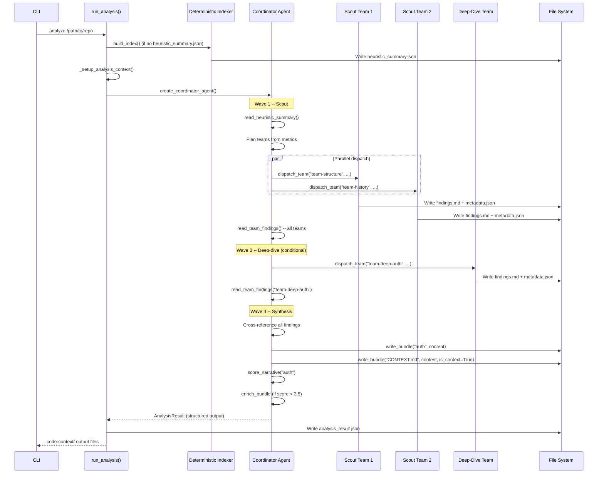
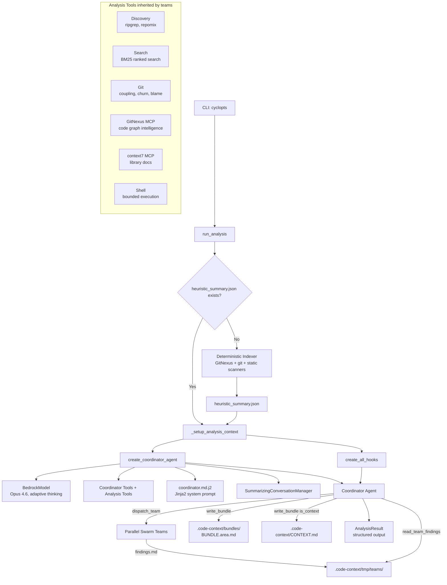
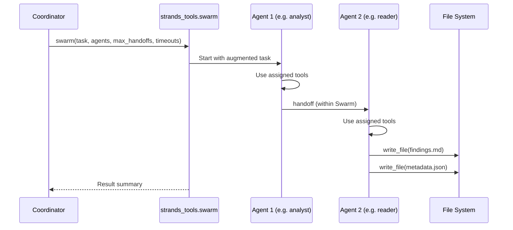
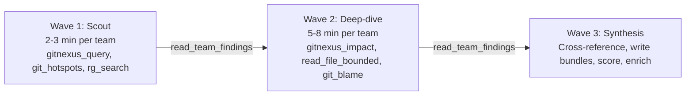
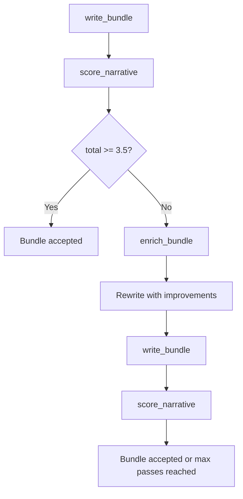

# Coordinator Pipeline

The analysis pipeline uses a single **Coordinator Agent** that plans and dispatches
parallel specialist **Swarm teams** based on pre-computed codebase metrics. The
coordinator reads the deterministic index output, decides how many teams to send
and where, reads their findings, cross-references signals, and writes narrative
bundles. The hub-and-spoke model adapts team count and composition to codebase
size and complexity.

---

## Pipeline flow



---

## Component diagram



---

## Coordinator agent

The coordinator is a standard `strands.Agent` -- not a Swarm node. It is created
by `create_coordinator_agent()` in `src/code_context_agent/agent/coordinator.py`.

### Model configuration

| Setting | Value | Source |
|---------|-------|--------|
| Model | `global.anthropic.claude-opus-4-6-v1` | `Settings.model_id` |
| Temperature | `1.0` | Required for adaptive thinking |
| Thinking mode | `adaptive` | Enabled via `additional_request_fields` |
| Reasoning effort | `max` (full) / `high` (standard) | `Settings.full_reasoning_effort` |
| Read timeout | 600s | boto3 client config |
| Retries | 10 (adaptive mode) | boto3 client config |
| Context extension | `context-1m-2025-08-07` beta | Anthropic beta header |

### System prompt composition

The system prompt is rendered from `src/code_context_agent/templates/coordinator.md.j2`
using Jinja2. The template receives:

- `repo_path` -- absolute path to the repository
- `output_dir` -- absolute path to the `.code-context` output directory
- `heuristic` -- the full heuristic summary dict (with dot-notation access via `_DictProxy`)
- `focus` -- optional focus area string

The template includes partials for tool orchestration rules, git history guidance,
GitNexus usage patterns, synthesis instructions, reasoning directives, business
logic detection, output formatting, and steering directives (conciseness, anti-patterns,
size limits, tool efficiency).

### Conversation management

The coordinator uses `SummarizingConversationManager` with:

- `summary_ratio=0.3` -- summarize when conversation exceeds 30% of context window
- `preserve_recent_messages=10` -- keep the last 10 messages intact during summarization

### Structured output

The coordinator produces `AnalysisResult` (defined in `src/code_context_agent/models/output.py`)
as its structured output model. The runner persists this to `analysis_result.json`.

---

## Coordinator tools

The coordinator has access to 6 exclusive tools (defined in
`src/code_context_agent/tools/coordinator_tools.py`) plus all analysis tools.

| Tool | Purpose | Key parameters |
|------|---------|----------------|
| `dispatch_team` | Dispatch a specialist Swarm team to investigate a codebase area | `team_id`, `mandate`, `agents` (list of agent specs), `file_scope`, `key_questions`, `execution_timeout`, `node_timeout` |
| `read_team_findings` | Read findings from completed teams; list all teams when `team_id` is omitted | `team_id` (optional) |
| `write_bundle` | Write a narrative bundle (`BUNDLE.{area}.md`) or the executive summary (`CONTEXT.md`) | `area`, `content`, `is_context` |
| `read_heuristic_summary` | Read the pre-computed heuristic summary from the deterministic indexer | (none) |
| `score_narrative` | Score a bundle's quality across 5 dimensions (specificity, structure, diagrams, depth, cross-references) | `bundle_area` |
| `enrich_bundle` | Read an existing bundle with feedback for rewriting; used when `score_narrative` reports a score below 3.5 | `bundle_area`, `feedback` |

All coordinator tools are configured at startup via `configure()`, which sets
module-level state for `_output_dir`, `_repo_path`, `_tool_registry`,
`_execution_timeout`, and `_node_timeout`.

---

## Team dispatch

### How teams are created

The coordinator decides team composition dynamically based on the heuristic summary.
The `dispatch_team` tool docstring encodes sizing heuristics:

| Codebase profile | Strategy |
|------------------|----------|
| < 200 files, < 5 communities | 1 team total, 2 agents (analyst + reader) |
| 200--2000 files, 5--15 communities | 1 team per major community (2--4 teams) |
| 2000+ files, 15+ communities | Top 5 communities get dedicated teams |
| `gitnexus.process_count` > 50 | Add cross-cutting team for shared processes |
| `--focus` set | 1 dedicated focus team scoped to focus community |
| `health.semgrep_findings.critical` > 0 | Mandatory security team regardless of size |

### Agent spec format

Each team consists of 2--3 agents defined as dicts:

```python
{
    "name": "structure_analyst",
    "system_prompt": "You are a structural analyst...",
    "tools": ["gitnexus_query", "gitnexus_context", "rg_search", "read_file_bounded"],
}
```

String tool names in the `tools` list are resolved to actual function objects
from `_tool_registry` at dispatch time. The registry is populated from
`get_analysis_tools()` during `configure()`.

### Swarm execution

Each dispatched team runs as a `strands_tools.swarm` invocation:



The task is augmented with:

- Team mandate and key questions
- File scope (if specified)
- Pre-computed artifact pointers
- Required output format instructions (findings.md + metadata.json paths)

### Tool inheritance

Team agents inherit tools from the coordinator's analysis tool set. The
coordinator passes all analysis tools to `configure()`, which populates
`_tool_registry`. When the coordinator specifies tool names in an agent spec,
`dispatch_team` resolves them to the actual function objects before passing
them to the Swarm runtime.

### Multi-wave pattern

The coordinator system prompt prescribes a multi-wave approach:



- **Wave 1 (Scout)**: Lightweight teams with broad search tools. Survey communities,
  flag complexity, identify cross-cutting concerns. Timeout: 2--3 minutes.
- **Wave 2 (Deep-dive)**: Targeted teams dispatched only for areas flagged by scouts
  as high-complexity, high-blast-radius, or security-critical. Full tool access.
  Timeout: 5--8 minutes.
- **Wave 3 (Synthesis)**: The coordinator reads all team findings, cross-references
  convergent and divergent signals, writes bundles, scores them, and enriches
  weak ones.

For small repos (< 200 files, < 5 communities), Waves 1 and 2 collapse into a
single wave with all tools.

---

## File-based handoff

Teams communicate with the coordinator through the file system, not through
in-memory message passing.

### Directory structure

```
.code-context/
  tmp/
    teams/
      team-structure/
        findings.md       # Markdown findings with file:line references
        metadata.json     # Execution metadata
      team-history/
        findings.md
        metadata.json
      team-deep-auth/
        findings.md
        metadata.json
      team_debug.jsonl    # Append-only debug log for all teams
  bundles/
    BUNDLE.auth.md
    BUNDLE.hotspots.md
  CONTEXT.md
  heuristic_summary.json
  analysis_result.json
```

### findings.md

Written by the last agent in each team. Contains markdown with:

- Clear sections for each investigation area
- `file:line` references for all claims
- Mermaid diagrams (never ASCII art)

### metadata.json

Written alongside findings. Schema:

```json
{
    "files_read": ["src/auth/handler.py", "src/auth/middleware.py"],
    "tools_used": ["gitnexus_query", "read_file_bounded", "git_hotspots"],
    "duration_s": 142.3,
    "status": "done"
}
```

### team_debug.jsonl

Append-only log written by `dispatch_team` after each team completes. Each line:

```json
{
    "team_id": "team-structure",
    "status": "completed",
    "duration_seconds": 142.3,
    "execution_timeout": 180,
    "node_timeout": 900,
    "agents": ["structure_analyst", "code_reader"],
    "agent_count": 2,
    "mandate_preview": "Survey the structural organization..."
}
```

### Reading findings

`read_team_findings()` supports two modes:

- **No arguments**: Lists all team directories with status and metadata summary.
  Used by the coordinator to check which teams have completed.
- **With `team_id`**: Returns the full `findings.md` content for a specific team.

The coordinator reads findings to cross-reference signals. Files or symbols
mentioned by multiple independent teams are high-confidence findings. Divergent
signals indicate areas needing follow-up investigation.

---

## Mode-aware behavior

The `--full` flag changes several pipeline parameters. The runner selects
timeouts and execution bounds based on the analysis mode in
`_setup_analysis_context()`.

| Parameter | Standard mode | Full mode (`--full`) |
|-----------|--------------|----------------------|
| Coordinator max duration | 1200s (20 min) | 3600s (60 min) |
| Coordinator max turns | 1000 | 3000 |
| Team execution timeout | 900s (15 min) | 2400s (40 min) |
| Team node timeout | 900s (15 min) | 1800s (30 min) |
| Reasoning effort | `high` | `max` |
| FailFastHook | Disabled | Enabled |

All timeout values come from `Settings` in `src/code_context_agent/config.py`
and are configurable via environment variables with the `CODE_CONTEXT_` prefix.
See [Configuration](../getting-started/configuration.md) for the full list.

The coordinator can also override per-team timeouts by passing explicit
`execution_timeout` and `node_timeout` values to `dispatch_team`. When omitted,
the configured defaults (which vary by mode) are used.

---

## Narrative quality loop

After bundles are written, the coordinator scores and optionally enriches them:



**Scoring dimensions** (each 0.0--5.0):

| Dimension | What it measures |
|-----------|-----------------|
| Specificity | Density of `file:line` references |
| Structure | Number of `##` and `###` markdown headings |
| Diagrams | Presence of mermaid code blocks |
| Depth | Total line count |
| Cross-references | Count of unique file paths mentioned |

The `NarrativeQualityHook` also runs after the coordinator invocation completes,
scoring all bundles and triggering up to 2 enrichment passes if average quality
is below 3.5.

---

## Hook system integration

The coordinator uses the same hook system as all strands agents. Hooks are
created by `create_all_hooks()` in `src/code_context_agent/agent/hooks.py`
and registered on the coordinator agent instance.

Active hooks for the coordinator:

| Hook | Purpose |
|------|---------|
| `ConversationCompactionHook` | Strips large tool payloads from older messages |
| `OutputQualityHook` | Warns on oversized tool outputs (> 100K chars) |
| `ToolEfficiencyHook` | Suggests dedicated tools over shell usage |
| `ReasoningCheckpointHook` | Injects reasoning prompts after key analysis tools |
| `NarrativeQualityHook` | Triggers enrichment passes for low-quality bundles |
| `FailFastHook` | Raises on tool errors (full mode only) |
| `ToolDisplayHook` | Updates `AgentDisplayState` for Rich TUI |
| `TeamDispatchHook` | Tracks team dispatch/completion for TUI display |
| `JsonLogHook` | Emits structured JSON log lines (quiet mode) |

See [Hook System](hooks.md) for detailed descriptions of each hook.
