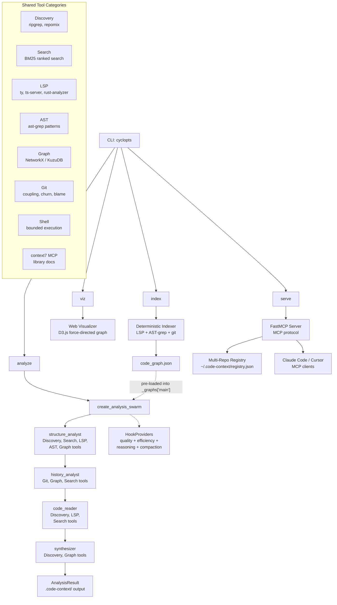

# Architecture Overview

## System Design



## Component Layout

```
src/code_context_agent/
├── cli.py              # CLI entry point (cyclopts): analyze, serve, viz, index, check
├── config.py           # Configuration (pydantic-settings)
├── indexer.py          # Deterministic indexer (LLM-free graph builder)
├── agent/              # Agent orchestration
│   ├── factory.py      # Single-agent creation (used by indexer)
│   ├── swarm.py        # Swarm factory: 4-node specialist pipeline
│   ├── analysts.py     # Specialist system prompts (Swarm + legacy)
│   ├── runner.py       # Analysis runner with Swarm execution
│   ├── prompts.py      # Jinja2 template rendering
│   └── hooks.py        # HookProviders: quality, efficiency, reasoning, compaction, display
├── templates/          # Jinja2 prompt templates
│   ├── system.md.j2    # Unified system prompt
│   ├── partials/       # Composable prompt sections
│   └── steering/       # Quality guidance fragments
├── models/             # Pydantic models
│   ├── base.py         # StrictModel, FrozenModel
│   └── output.py       # AnalysisResult, BusinessLogicItem, etc.
├── mcp/                # FastMCP v3 server
│   ├── __init__.py     # Package init
│   ├── server.py       # MCP tools, resources, and server definition
│   └── registry.py     # Multi-repo registry (~/.code-context/registry.json)
├── consumer/           # Event display (Rich TUI)
│   ├── base.py         # EventConsumer ABC
│   ├── phases.py       # 10-phase detection, discovery events
│   ├── rich_consumer.py # Dashboard with phase indicator + discovery feed
│   └── state.py        # AgentDisplayState with phase/discovery tracking
├── tools/              # Analysis tools (49)
│   ├── discovery.py    # ripgrep, repomix, write_file (11 tools)
│   ├── search/         # BM25 ranked search (1 tool)
│   │   ├── bm25.py     # BM25Index with rank_bm25 backend
│   │   └── tools.py    # bm25_search @tool wrapper
│   ├── astgrep.py      # ast-grep (3 tools)
│   ├── git.py          # git history (7 tools)
│   ├── shell_tool.py   # Shell with security hardening
│   ├── clones.py       # Clone detection via jscpd
│   ├── validation.py   # Input validation (path traversal, injection prevention)
│   ├── lsp/            # LSP integration (8 tools)
│   └── graph/          # Graph analysis (14 tools)
│       ├── model.py    # CodeGraph, CodeNode, CodeEdge (with confidence)
│       ├── analysis.py # CodeAnalyzer: blast_radius, diff_impact, flows
│       ├── tools.py    # @tool wrappers for graph operations
│       ├── adapters.py # Ingestion adapters (LSP, AST-grep, git, clones)
│       ├── disclosure.py # ProgressiveExplorer
│       ├── frameworks.py # Framework detection (Next.js, FastAPI, Django, etc.)
│       └── storage.py  # GraphStorage protocol, NetworkXStorage, KuzuStorage
├── viz/                # Web visualization (D3.js)
│   ├── index.html      # Single-page app
│   ├── style.css       # Dark theme styles
│   └── js/             # Modules: graph, hotspots, modules, dependencies, narrative
└── rules/              # ast-grep rule packs
```

## Key Design Decisions

### Agent Framework: Strands

The agent uses [Strands Agents SDK](https://github.com/strands-agents/sdk-python) with Claude Opus 4.6 via Amazon Bedrock. Strands provides:

- Tool registration and dispatch
- Structured output via Pydantic models
- Multi-agent Swarm orchestration (4-node specialist pipeline)
- HookProviders for quality, efficiency, reasoning checkpoints, and conversation compaction
- Hook-driven display (Rich TUI updates via `SwarmDisplayHook` + `ToolDisplayHook`)

### Prompt Architecture: Jinja2 Templates

The system prompt is composed from modular Jinja2 templates:

- **`system.md.j2`** -- Unified entry point that includes all partials
- **`partials/`** -- Composable sections (rules, business logic, output format, tool-specific guidance)
- **`steering/`** -- Quality fragments (size limits, conciseness, anti-patterns, tool efficiency)

This allows the prompt to adapt based on detected codebase characteristics without maintaining multiple monolithic prompts.

### Five Signal Layers

The analysis combines five distinct signal sources, following [Tenet 2: Layer signals, read less](tenets.md#2-layer-signals-read-less):

1. **Static structure** (AST/types) -- ast-grep patterns, LSP symbols
2. **Dynamic relationships** (call graphs) -- LSP references, definitions
3. **Temporal evolution** (git history) -- churn, coupling, blame
4. **Compressed abstractions** (signatures) -- Tree-sitter compression via repomix
5. **Human intent** (naming, commits) -- commit messages, file naming patterns

### Graph-First Ranking

Files are ranked by graph metrics rather than heuristics, following [Tenet 1: Measure, don't guess](tenets.md#1-measure-dont-guess):

- **Betweenness centrality** -- identifies bridge/bottleneck files
- **PageRank/TrustRank** -- identifies foundational modules
- **Louvain/Leiden communities** -- detects module boundaries
- **Triangle detection** -- finds tightly coupled triads
- **Blast radius** -- quantifies change impact with confidence-weighted decay
- **Execution flows** -- traces call paths from entry points to leaves
- **Diff impact** -- maps changed lines to affected graph nodes and suggests tests
- **Framework detection** -- boosts entry point scoring for known frameworks (Next.js, FastAPI, Django, etc.)

### Structured Output

The agent produces a Pydantic-typed `AnalysisResult` rather than freeform text, following [Tenet 5: Machines read it first](tenets.md#5-machines-read-it-first). This enables downstream agents to parse the output programmatically.

### MCP Server (FastMCP v3)

The `mcp/` package exposes the core differentiators via the [Model Context Protocol](https://modelcontextprotocol.io), enabling coding agents (Claude Code, Cursor, etc.) to use the analysis capabilities directly:

- **Tools**: `start_analysis`/`check_analysis` (kickoff/poll), `query_code_graph` (12 algorithms), `explore_code_graph` (progressive disclosure), `get_graph_stats`, `list_repos` (multi-repo registry), `diff_impact` (change impact analysis), `execute_cypher` (KuzuDB queries)
- **Resources**: Read-only access to analysis artifacts via `analysis://` URI templates
- **Transport**: stdio (default, for local MCP clients) or HTTP (for networked access)
- **Hints**: All tool responses include `next_steps` with context-sensitive guidance for AI clients

Commodity tools (ripgrep, LSP, git, ast-grep) are intentionally not exposed -- they are already available in every coding agent's MCP marketplace.

### Multi-Repo Registry

The `mcp/registry.py` module maintains a central registry at `~/.code-context/registry.json`. Completed analyses are auto-registered so MCP clients can discover available repos via `list_repos`. Graphs are cached in memory with a 5-minute TTL.

### Deterministic Indexer

The `indexer.py` module provides `code-context-agent index` -- a fast, LLM-free pipeline that builds a code graph deterministically using LSP, AST-grep, git history, and clone detection. Steps that require missing tools are skipped gracefully. The resulting `code_graph.json` is immediately queryable via MCP tools.

### Graph Storage Backends

The `tools/graph/storage.py` module defines a `GraphStorage` protocol with two implementations:

- **NetworkXStorage** -- in-memory, wraps the existing `CodeGraph` (default)
- **KuzuStorage** -- persistent, backed by [KuzuDB](https://kuzudb.com/) on disk with Cypher query support via `execute_cypher`

### Web Visualization

The `viz/` package provides a D3.js-based interactive visualization served locally via `code-context-agent viz`. Features include force-directed graph rendering, module coloring, hotspot highlighting, dependency chains, and the CONTEXT.md narrative. The viz command serves static files and proxies `/data/` requests to the `.code-context/` output directory.

### context7 MCP Integration

The analysis agent loads [context7](https://context7.com) documentation tools via `strands.tools.mcp.MCPClient`, enabling library documentation lookup during analysis. This is controlled by `CODE_CONTEXT_CONTEXT7_ENABLED` (default: true) and requires `npx`.

### Mode-Aware Pipeline

The `--full` flag triggers exhaustive analysis. The mode is threaded through the entire pipeline:

```
CLI (--full) → _derive_mode() → run_analysis(mode=)
                                      ↓
                              _setup_analysis_context()
                                      ↓
                              create_analysis_swarm(mode=, graph_path=, hooks=)
                                      ↓
                              swarm.invoke_async(initial_prompt)
                                      ↓
                              create_all_hooks(full_mode=, state=, quiet=)
                              → (agent_hooks, swarm_hooks)
```

- **`create_all_hooks()`** returns an `(agent_hooks, swarm_hooks)` tuple
- **Agent hooks**: `ConversationCompactionHook`, `OutputQualityHook`, `ToolEfficiencyHook`, `ReasoningCheckpointHook`, `FailFastHook` (full mode only), plus display hooks (`ToolDisplayHook` or `JsonLogHook`)
- **Swarm hooks**: `SwarmDisplayHook` or `JsonLogSwarmHook` for agent transitions
- **Phase detection** still maps tool calls to 10 analysis phases for TUI display
- **Discovery feed** extracts notable findings from tool results (file counts, symbol counts, hotspots)
- **Mode-aware prompt** switches between size-limited (`_size_limits.md.j2`) and exhaustive (`_full_mode.md.j2`) steering directives

See [Full Mode](../getting-started/full-mode.md) and [TUI Phases](tui-phases.md) for details.

---

## Security Model

The agent operates within a defense-in-depth security boundary:

- **Shell allowlist** -- Only a curated set of read-only programs can execute via the `shell` tool. Write operations, network commands, and shell operators are blocked.
- **Input validation** -- All tool inputs (paths, patterns, globs) pass through validation functions that prevent path traversal and command injection.
- **Path containment** -- File operations are validated to stay within the repository root.
- **Git read-only** -- Git subcommands are restricted to read-only operations (log, diff, blame, status, etc.).

See the [Security documentation](../security/overview.md) for full details on the security model and CI pipeline.
