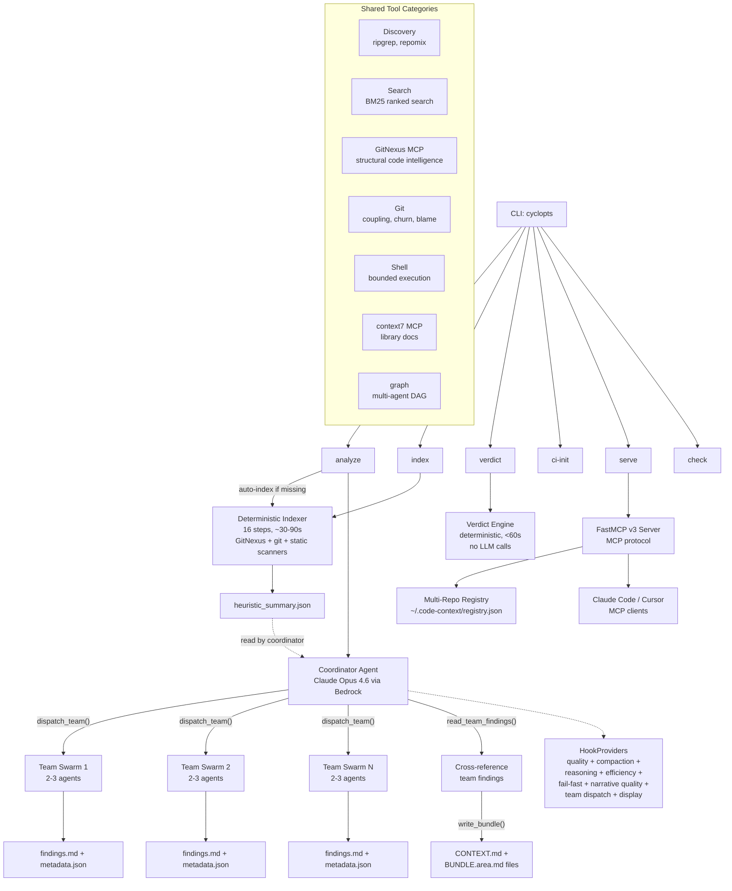
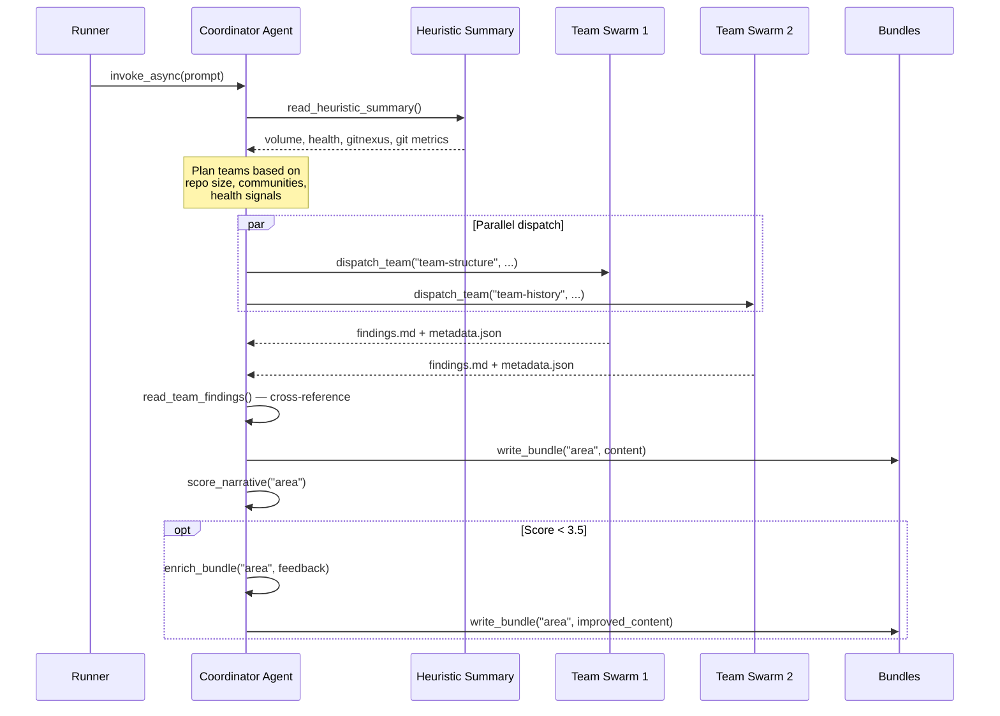

# Architecture Overview

## System Design



## Component Layout

```
src/code_context_agent/
├── cli.py              # CLI entry point (cyclopts): analyze, index, verdict, ci-init, serve, check
├── config.py           # Configuration (pydantic-settings), CODE_CONTEXT_ prefix
├── indexer.py          # Deterministic indexer (16-step LLM-free pipeline)
├── verdict.py          # Change verdict engine (deterministic, <60s, no LLM)
├── temporal.py         # Temporal snapshot utilities
├── display.py          # Welcome display and CLI formatting
├── exceptions.py       # Custom exception types
├── agent/              # Agent orchestration
│   ├── coordinator.py  # Coordinator agent factory: model, tools, heuristic prompt
│   ├── factory.py      # Analysis tool collection + GitNexus/context7 MCP providers
│   ├── runner.py       # Analysis runner: setup → coordinator → results
│   └── hooks.py        # 9 HookProviders: quality, compaction, efficiency, reasoning,
│                        #   fail-fast, narrative quality, team dispatch, display, JSON log
├── templates/          # Jinja2 prompt templates
│   ├── coordinator.md.j2       # Coordinator system prompt (~35 lines + partials)
│   ├── context_output.md.j2    # Context output format template
│   ├── partials/               # Composable prompt sections
│   │   ├── _business_logic.md.j2
│   │   ├── _git_history.md.j2
│   │   ├── _gitnexus.md.j2    # GitNexus tool guidance
│   │   ├── _output_format.md.j2
│   │   ├── _reasoning.md.j2
│   │   ├── _rules.md.j2
│   │   └── _synthesis.md.j2   # Cross-reference and synthesis guidance
│   └── steering/               # Quality guidance fragments
│       ├── _anti_patterns.md.j2
│       ├── _conciseness.md.j2
│       ├── _size_limits.md.j2
│       └── _tool_efficiency.md.j2
├── models/             # Pydantic models
│   ├── base.py         # StrictModel, FrozenModel
│   ├── index.py        # Index artifact models
│   └── output.py       # AnalysisResult, Bundle, BusinessLogicItem, etc.
├── mcp/                # FastMCP v3 server
│   ├── server.py       # MCP tools, resources, and server definition
│   └── registry.py     # Multi-repo registry (~/.code-context/registry.json)
├── consumer/           # Event display (Rich TUI)
│   ├── base.py         # EventConsumer ABC
│   ├── phases.py       # 5-phase AnalysisPhase enum, tool-to-phase mapping
│   ├── rich_consumer.py # Dashboard with phase indicator + discovery feed
│   └── state.py        # AgentDisplayState with phase/team/discovery tracking
├── tools/              # Analysis tools
│   ├── coordinator_tools.py  # 6 coordinator-only tools (dispatch, read, write, score, enrich)
│   ├── discovery.py          # ripgrep, repomix, write_file, read_file (12 tools)
│   ├── search/               # BM25 ranked search (1 tool)
│   │   ├── bm25.py           # BM25Index with rank_bm25 backend
│   │   └── tools.py          # bm25_search @tool wrapper
│   ├── git.py                # git history (7 tools)
│   ├── shell_tool.py         # Shell with security hardening
│   ├── shell.py              # Shell tool implementation
│   └── validation.py         # Input validation (path traversal, injection prevention)
├── issues/             # Issue provider integration
│   └── github.py       # GitHub issue fetching for --issue flag
├── ci/                 # CI/CD workflow generation
│   └── templates/      # GitHub Actions + GitLab CI templates
├── utils/              # Shared utilities
│   └── logging.py      # Logger setup
└── py.typed            # PEP 561 marker
```

## Key Design Decisions

### Agent Framework: Strands

The agent uses [Strands Agents SDK](https://github.com/strands-agents/sdk-python) with Claude Opus 4.6 via Amazon Bedrock. Strands provides:

- Tool registration via `@tool` decorators
- Structured output via Pydantic models (`AnalysisResult`)
- Multi-agent Swarm orchestration (used by `dispatch_team` for specialist teams)
- `graph` tool for multi-agent DAG orchestration
- HookProviders for quality control, reasoning checkpoints, and display
- `SummarizingConversationManager` for automatic context compaction

### Coordinator + Team Dispatch Pattern

The analysis pipeline uses a **coordinator agent** that dispatches parallel **Swarm teams**, replacing the earlier sequential pipeline:



Key characteristics:

- **Coordinator is a regular Agent** (not a Swarm node) created by `coordinator.py`
- **Teams are Swarm instances** dispatched via `strands_tools.swarm` inside `dispatch_team`
- **Team sizing is heuristic-driven** -- the coordinator reads `heuristic_summary.json` and scales team count based on file count, community count, and health signals
- **Teams write to disk** at `.code-context/tmp/teams/{team_id}/findings.md` + `metadata.json`
- **Narrative quality loop** -- `score_narrative` evaluates bundles on 5 dimensions; `enrich_bundle` triggers rewrites for weak bundles

### Prompt Architecture: Jinja2 Templates

The coordinator system prompt is composed from modular Jinja2 templates:

- **`coordinator.md.j2`** -- Entry point that includes partials with heuristic data
- **`partials/`** -- Composable sections: GitNexus guidance, synthesis rules, business logic, git history, reasoning, output format
- **`steering/`** -- Quality fragments: size limits, conciseness, anti-patterns, tool efficiency

The template receives a `heuristic` namespace object with dot-notation access to index metrics, allowing the prompt to adapt to the specific codebase being analyzed.

### Deterministic Indexer (16 Steps)

The `indexer.py` module provides `code-context-agent index` -- a fast, LLM-free pipeline that produces artifacts for the coordinator:

| Step | What |
|------|------|
| 1 | File manifest via ripgrep |
| 1a | Write manifest to disk |
| 2 | Language detection from extensions |
| 3 | GitNexus analyze (Tree-sitter graph indexing) |
| 4 | Git hotspots + co-changes |
| 5 | Repomix compressed signatures |
| 6 | Repomix orientation |
| 7 | BM25 index prebuild |
| 8 | Semgrep auto |
| 9 | Semgrep OWASP |
| 10 | Type checker |
| 11 | Linter |
| 12 | Complexity analysis |
| 13 | Dead code (Python) |
| 14 | Dead code (TypeScript) |
| 15 | Dependencies |
| 16 | Generate `heuristic_summary.json` |

Steps that require missing tools are skipped gracefully. The resulting `heuristic_summary.json` is the bridge between the deterministic indexer and the coordinator agent.

### GitNexus for Structural Code Intelligence

GitNexus replaces the previous internal graph/LSP/AST tool stack with an external MCP server that provides:

- **Semantic search** (`gitnexus_query`) -- find code by concept with process-grouped results
- **Symbol context** (`gitnexus_context`) -- 360-degree view of callers, callees, process participation
- **Impact analysis** (`gitnexus_impact`) -- blast radius with confidence-weighted depth scoring
- **Change detection** (`gitnexus_detect_changes`) -- scope verification before commits
- **Custom queries** (`gitnexus_cypher`) -- Cypher against the knowledge graph
- **Repo listing** (`gitnexus_list_repos`) -- enumerate indexed repositories

GitNexus is loaded as an `MCPClient` tool provider in `factory.py` and prefixed with `gitnexus_`.

### Five-Phase Pipeline

The TUI maps tool calls to five analysis phases defined in `consumer/phases.py`:

| Phase | Tools | What Happens |
|-------|-------|-------------|
| 1. Indexing | (pre-analysis) | Deterministic indexer builds artifacts |
| 2. Team Planning | `read_heuristic_summary` | Coordinator reads metrics, plans teams |
| 3. Team Execution | `dispatch_team` + all analysis tools | Parallel teams investigate the codebase |
| 4. Consolidation | `read_team_findings` | Coordinator cross-references team findings |
| 5. Bundle Generation | `write_bundle` | Coordinator writes narrative bundles |

### Hook Providers

The `hooks.py` module provides 9 hook provider classes registered on the coordinator agent:

| Hook | Purpose |
|------|---------|
| `ConversationCompactionHook` | Strips large tool payloads from older messages to prevent context overflow |
| `OutputQualityHook` | Warns on oversized tool outputs |
| `ToolEfficiencyHook` | Suggests dedicated tools when shell is used for tasks like grep/cat |
| `ReasoningCheckpointHook` | Injects reasoning prompts after key analysis tools to force interpretation |
| `NarrativeQualityHook` | Auto-triggers enrichment passes when bundle quality is below threshold |
| `FailFastHook` | Raises on tool errors in `--full` mode (non-exempt tools only) |
| `TeamDispatchHook` | Tracks team dispatch/completion for TUI progress display |
| `ToolDisplayHook` | Updates `AgentDisplayState` with active tool info for TUI |
| `JsonLogHook` | Emits structured JSON log lines for `--quiet` / CI mode |

`create_all_hooks()` assembles the appropriate subset based on mode (full vs standard) and display (TUI vs quiet).

### Structured Output

The agent produces a Pydantic-typed `AnalysisResult` rather than freeform text, following [Tenet 5: Machines read it first](tenets.md#5-machines-read-it-first). The coordinator agent is configured with `structured_output_model=AnalysisResult`, and the result is persisted to `analysis_result.json`.

### MCP Server (FastMCP v3)

The `mcp/` package exposes capabilities via the [Model Context Protocol](https://modelcontextprotocol.io) that complement GitNexus:

- **Tools** (11): `start_analysis`/`check_analysis` (kickoff/poll), `git_evolution` (hotspots, coupling, contributors), `static_scan_findings` (semgrep, typecheck, lint, complexity, dead code), `heuristic_summary`, `list_repos`, `review_classification`, `change_verdict`, `consistency_check`, `risk_trend`, `cross_repo_impact`
- **Resources**: Read-only access to analysis artifacts via `analysis://` URI templates
- **Transport**: stdio (default), HTTP, or SSE
- **Hints**: All tool responses include `next_steps` with context-sensitive guidance for AI clients

Commodity tools (ripgrep, git, shell) are intentionally not exposed -- they are already available in every coding agent's toolkit. Structural code intelligence is handled by GitNexus.

### Multi-Repo Registry

The `mcp/registry.py` module maintains a central registry at `~/.code-context/registry.json`. Completed analyses are auto-registered so MCP clients can discover available repos via `list_repos`. Graphs are cached in memory with a 5-minute TTL.

### Change Verdict

The `verdict.py` module provides `code-context-agent verdict` -- a deterministic, sub-60-second engine that computes change verdicts for PRs/diffs against pre-computed analysis artifacts. Designed for CI/CD integration with structured exit codes.

### CI/CD Workflow Generation

The `ci/` package provides `code-context-agent ci-init` which generates workflow templates for GitHub Actions and/or GitLab CI with three cadences:

- **Nightly**: Full analysis (risk profiles, patterns, temporal snapshots)
- **On-merge**: Incremental index (keeps structural graph current)
- **PR**: Fast change verdict against cached context

### Mode-Aware Pipeline

The `--full` flag triggers exhaustive analysis. The mode is threaded through the entire pipeline:

```
CLI (--full/--focus/--quick) → _derive_mode() → run_analysis(mode=)
                                                     ↓
                                             _setup_analysis_context()
                                                     ↓
                                             create_coordinator_agent(timeouts=)
                                                     ↓
                                             coordinator.invoke_async(prompt)
                                                     ↓
                                             create_all_hooks(full_mode=, state=, quiet=)
```

- **Standard**: Default timeouts, no fail-fast
- **Full**: Extended timeouts (`full_team_execution_timeout`, `full_team_node_timeout`), `FailFastHook` enabled, `max` reasoning effort
- **Focus**: Adds focus area to coordinator prompt
- **Quick**: Lightweight single-wave analysis for nightly CI
- **Bundles-only**: Skips indexing and team dispatch; regenerates bundles from existing findings

### context7 MCP Integration

The analysis agent loads [context7](https://context7.com) documentation tools via `strands.tools.mcp.MCPClient`, enabling library documentation lookup during analysis. Controlled by `CODE_CONTEXT_CONTEXT7_ENABLED` (default: true) and requires `npx`.

---

## Security Model

The agent operates within a defense-in-depth security boundary:

- **Shell allowlist** -- Only a curated set of read-only programs can execute via the `shell` tool. Write operations, network commands, and shell operators are blocked.
- **Input validation** -- All tool inputs (paths, patterns, globs) pass through validation functions that prevent path traversal and command injection.
- **Path containment** -- File operations are validated to stay within the repository root.
- **Git read-only** -- Git subcommands are restricted to read-only operations (log, diff, blame, status, etc.).

See the [Security documentation](../security/overview.md) for full details on the security model and CI pipeline.
