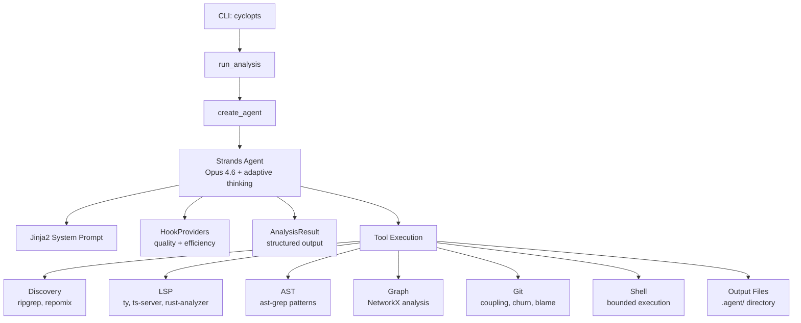

# Architecture Overview

## System Design



## Component Layout

```
src/code_context_agent/
├── cli.py              # CLI entry point (cyclopts)
├── config.py           # Configuration (pydantic-settings)
├── agent/              # Agent orchestration
│   ├── factory.py      # Agent creation with tools + structured output
│   ├── runner.py       # Analysis runner with event streaming
│   ├── prompts.py      # Jinja2 template rendering
│   └── hooks.py        # HookProvider for quality/efficiency
├── templates/          # Jinja2 prompt templates
│   ├── system.md.j2    # Unified system prompt
│   ├── partials/       # Composable prompt sections
│   └── steering/       # Quality guidance fragments
├── models/             # Pydantic models
│   ├── base.py         # StrictModel, FrozenModel
│   └── output.py       # AnalysisResult, BusinessLogicItem, etc.
├── consumer/           # Event display (Rich TUI)
├── tools/              # Analysis tools (40+)
│   ├── discovery.py    # ripgrep, repomix (6 tools)
│   ├── astgrep.py      # ast-grep (3 tools)
│   ├── git.py          # git history (7 tools)
│   ├── lsp/            # LSP integration (8 tools)
│   └── graph/          # NetworkX analysis (12 tools)
└── rules/              # ast-grep rule packs
```

## Key Design Decisions

### Agent Framework: Strands

The agent uses [Strands Agents SDK](https://github.com/strands-agents/sdk-python) with Claude Opus 4.6 via Amazon Bedrock. Strands provides:

- Tool registration and dispatch
- Structured output via Pydantic models
- Event streaming for real-time progress display
- HookProviders for quality and efficiency guardrails

### Prompt Architecture: Jinja2 Templates

The system prompt is composed from modular Jinja2 templates:

- **`system.md.j2`** --- Unified entry point that includes all partials
- **`partials/`** --- Composable sections (rules, business logic, output format, tool-specific guidance)
- **`steering/`** --- Quality fragments (size limits, conciseness, anti-patterns, tool efficiency)

This allows the prompt to adapt based on detected codebase characteristics without maintaining multiple monolithic prompts.

### Five Signal Layers

The analysis combines five distinct signal sources, following [Tenet 2: Layer signals, read less](tenets.md#2-layer-signals-read-less):

1. **Static structure** (AST/types) --- ast-grep patterns, LSP symbols
2. **Dynamic relationships** (call graphs) --- LSP references, definitions
3. **Temporal evolution** (git history) --- churn, coupling, blame
4. **Compressed abstractions** (signatures) --- Tree-sitter compression via repomix
5. **Human intent** (naming, commits) --- commit messages, file naming patterns

### Graph-First Ranking

Files are ranked by graph metrics rather than heuristics, following [Tenet 1: Measure, don't guess](tenets.md#1-measure-dont-guess):

- **Betweenness centrality** --- identifies bridge/bottleneck files
- **PageRank/TrustRank** --- identifies foundational modules
- **Louvain/Leiden communities** --- detects module boundaries
- **Triangle detection** --- finds tightly coupled triads

### Structured Output

The agent produces a Pydantic-typed `AnalysisResult` rather than freeform text, following [Tenet 5: Machines read it first](tenets.md#5-machines-read-it-first). This enables downstream agents to parse the output programmatically.
