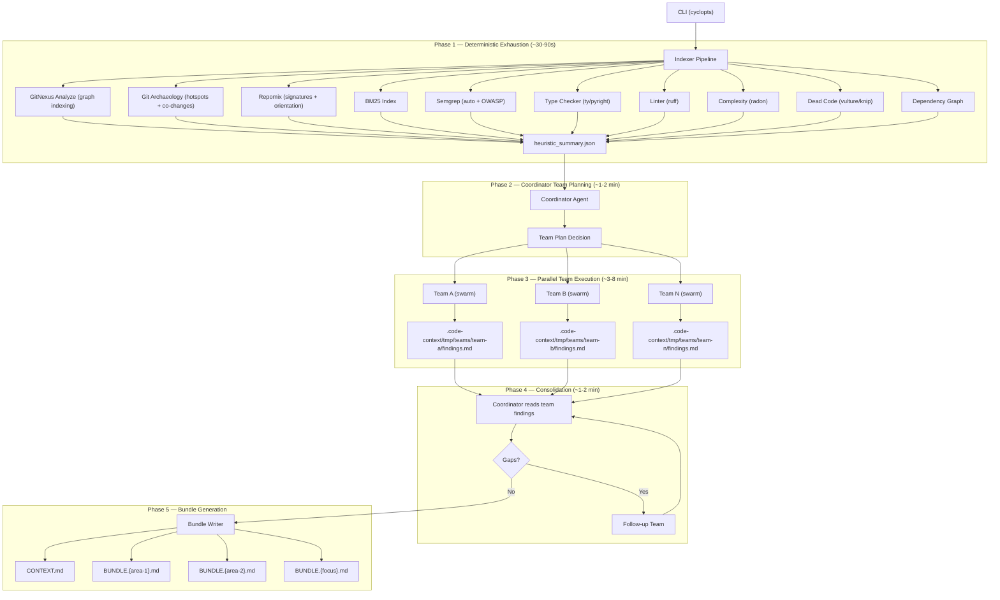
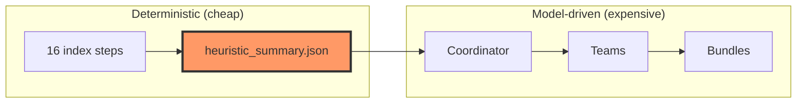
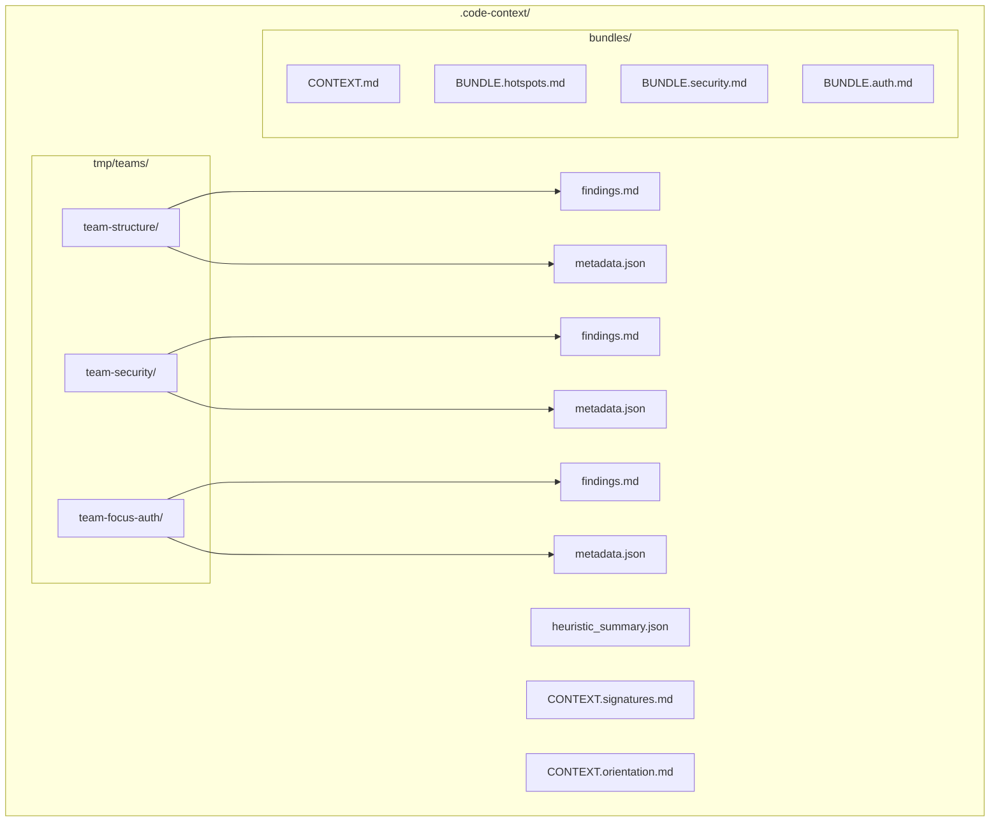
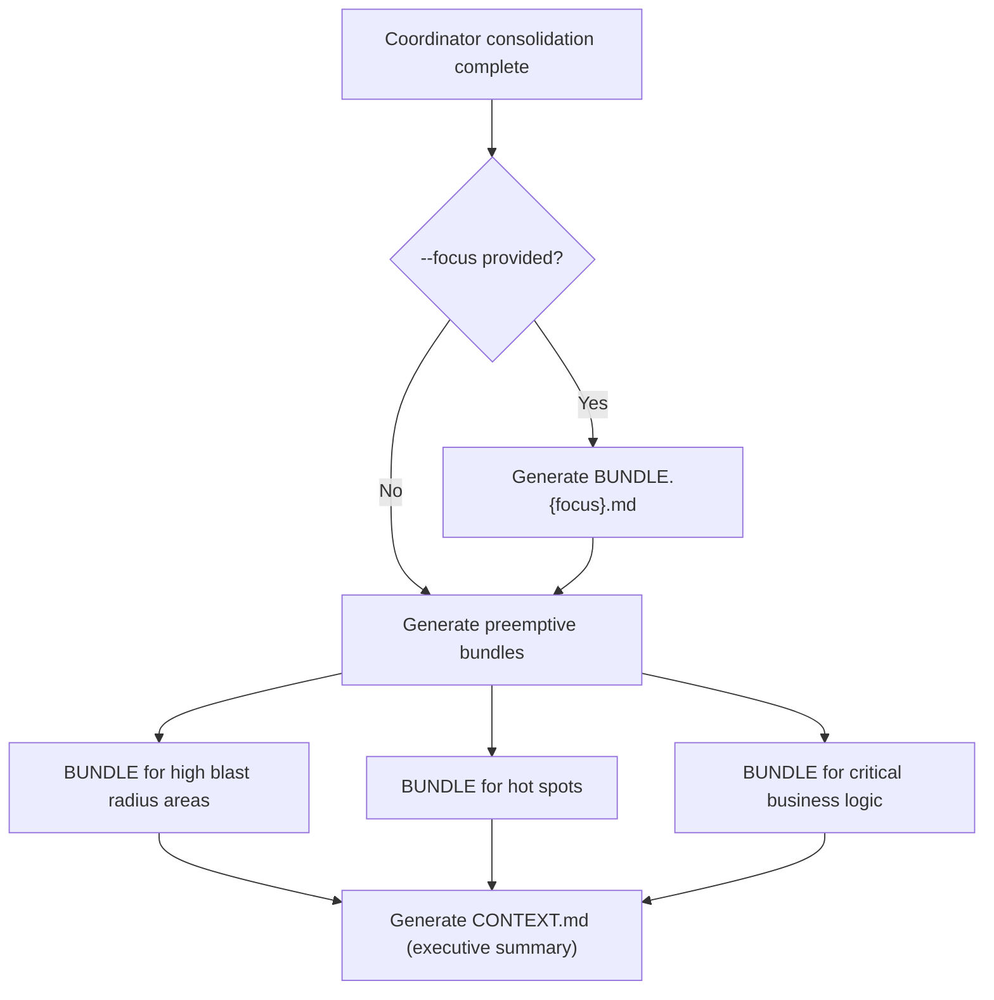

# Progressive Disclosure: The 5-Phase Code Intelligence Pipeline

## Design Tenet

**Progressive disclosure**: exhaust deterministic, pattern-based, and structural
analysis before spending a single LLM token. Every dollar of model inference
should be spent on reasoning that static tools cannot perform — narrative
synthesis, business logic interpretation, risk judgment, and cross-cutting
insight correlation.

## Architecture Overview



## Phase 1: Deterministic Exhaustion (~30-90s)

Run every tool that requires zero LLM inference. These tools operate on
Tree-sitter parsing, graph algorithms, static analysis, and git archaeology.
All outputs land in `.code-context/` as structured JSON or markdown artifacts.

### Indexer pipeline (`indexer.py`, 16 steps):

| Step | Tool | Output | What it captures |
|------|------|--------|-----------------|
| 1 | ripgrep `--files` | `files.all.txt` | Complete file manifest |
| 1a | Write manifest | `files.all.txt` on disk | Persisted for BM25 and downstream tools |
| 2 | Extension mapping | Language groups | Files grouped by language (py, ts, go, etc.) |
| 3 | `gitnexus analyze` | `.gitnexus/` graph index | Tree-sitter parsing, symbol graph, clustering, execution flows |
| 4 | `git log` + `git show` | `git_hotspots.json`, `git_cochanges.json` | Commit frequency hotspots and co-change pairs |
| 5 | `repomix --compress` | `CONTEXT.signatures.md` | Compressed source signatures (tree-sitter body stripping) |
| 6 | `repomix --no-files --token-count-tree` | `CONTEXT.orientation.md` | Token-aware project overview |
| 7 | `rank_bm25` | In-memory BM25 index | Pre-built search index for zero-latency first query |
| 8 | `semgrep --config auto` | `semgrep_auto.json` | General quality, anti-patterns, security smells |
| 9 | `semgrep --config p/owasp-top-ten` | `semgrep_owasp.json` | OWASP Top 10 vulnerability matches |
| 10 | `ty check` / `pyright` | `typecheck.json` | Type errors, missing annotations, inference gaps |
| 11 | `ruff check --output-format json` | `lint.json` | Style violations, complexity warnings, import issues |
| 12 | `radon cc -j` | `complexity.json` | Cyclomatic complexity per function |
| 13 | `vulture` | `dead_code_py.json` | Unused Python functions, classes, imports, variables |
| 14 | `knip --reporter json` | `dead_code_ts.json` | Unused TS/JS exports, dependencies, files, types |
| 15 | `pipdeptree --json` / `npm ls --json` | `deps.json` | Direct + transitive dependency tree |
| 16 | Aggregation | `heuristic_summary.json` | Bridge artifact for coordinator (see below) |

Every tool follows the same pattern: `shutil.which()` check, `subprocess.run()`
with timeout, parse structured output, write artifact. Failures are graceful --
if a tool is missing or times out, the step is skipped and indexing continues.

### Heuristic Summary: The Progressive Disclosure Boundary

After all deterministic tools complete, the indexer generates
`heuristic_summary.json` -- the **only** artifact the coordinator reads before
making its team-planning decision. It is the narrowest possible surface that
lets the coordinator decide depth and breadth without reading source code.



**Structure:**

```json
{
  "volume": {
    "total_files": 1847,
    "total_lines": 142000,
    "estimated_tokens": 35500000,
    "languages": {"py": 1200, "ts": 500, "go": 147}
  },
  "health": {
    "semgrep_findings": {"critical": 2, "high": 14, "medium": 47, "low": 12, "info": 3},
    "owasp_findings": {"injection": 1, "xss": 3},
    "type_errors": 23,
    "lint_violations": 156,
    "dead_code_symbols": 89,
    "avg_cyclomatic_complexity": 6.2
  },
  "complexity": {
    "top_complex_functions": [
      {"name": "process_order", "file": "src/orders/engine.py", "lines": "142-298", "complexity": 34}
    ],
    "bus_factor_risks": ["src/billing/ (1 contributor, 40 files)"]
  },
  "git": {
    "total_commits_analyzed": 200,
    "active_contributors": 12,
    "most_coupled_pairs": [
      "src/orders/engine.py <-> src/orders/models.py",
      "src/api/router.py <-> src/api/schemas.py"
    ]
  },
  "gitnexus": {
    "indexed": true,
    "repo_name": "my-project",
    "community_count": 8,
    "process_count": 24,
    "symbol_count": 6400,
    "edge_count": 18200,
    "top_communities": [
      {"name": "Order Processing", "symbols": 340, "cohesion": 0.82},
      {"name": "Auth & Sessions", "symbols": 210, "cohesion": 0.91}
    ]
  },
  "mcp": {
    "context7_available": true
  }
}
```

The schema reflects the actual `_generate_heuristic_summary` implementation in
`indexer.py`. Key sections:

- **`volume`** -- file count, line count, estimated tokens, language distribution
- **`health`** -- aggregated findings from semgrep, type checker, linter, dead code tools
- **`complexity`** -- top complex functions (from radon) and bus factor risks (from git)
- **`git`** -- commit count, contributor count, most-coupled file pairs
- **`gitnexus`** -- structural graph metadata: community/process/symbol/edge counts, top communities with cohesion scores
- **`mcp`** -- availability flags for optional MCP providers (context7)

## Phase 2: Coordinator Team Planning (model-driven, ~1-2 min)

The coordinator agent receives `heuristic_summary.json` and the user's optional
`--focus` argument.

### Key design principle: tools teach themselves

The coordinator prompt stays lean. Instead of embedding agent spec templates,
tool usage rules, and dispatch instructions in the system prompt, those
behaviors live in **tool docstrings**:

- A `@tool`-decorated `dispatch_team` wrapper (around `strands_tools.swarm`)
  carries its own description of team sizing, agent specs, and dispatch patterns
- A `@tool`-decorated `read_team_findings` carries its own description of how
  to read and interpret team results
- A `@tool`-decorated `write_bundle` carries its own description of bundle
  structure and format

The coordinator prompt provides only: identity, pre-computed heuristic summary,
the user's focus (if any), and the goal (produce bundles). The tools guide the
how.

### Decision inputs (available in heuristic summary):

- **Volume metrics** -- file count, token count, language count -> breadth
- **Health signals** -- semgrep criticals, OWASP findings, high complexity -> mandatory targets
- **GitNexus topology** -- community count, process count, top communities -> structural organization
- **Complexity signals** -- top complex functions, bus factor risks -> structural hotspots
- **Git coupling** -- most-coupled file pairs -> implicit dependencies
- **Focus argument** -- if provided, guarantees at least one dedicated team

### Decision outputs (per team):

- **Team ID** (e.g., `team-structure`, `team-security`, `team-focus-auth`)
- **Mandate** -- what to investigate and why
- **File scope** -- specific files/directories/modules
- **Tool subset** -- which tools this team needs
- **Key questions** -- what the coordinator wants answered
- **Artifact pointers** -- which Phase 1 artifacts to consult

## Phase 3: Team Execution (parallel, ~3-8 min)

Each team executes as a Swarm (2-3 agents) dispatched via `dispatch_team`. Teams
run in parallel via `ConcurrentToolExecutor`.

### What teams do that deterministic tools cannot:

- **Read actual source code** and understand business domain semantics
- **Correlate findings** across tools (a high-complexity function that is also a
  git hotspot AND has a semgrep finding is a critical risk)
- **Identify implicit contracts** not captured by type systems or call graphs
- **Assess architectural intent** vs. implementation reality
- **Produce narrative explanations** of why code exists and what it does

### Team result persistence:



File-based handoff (vs. passing results through swarm return values) enables:

- Findings persist even if a team times out or errors
- Coordinator reads findings incrementally
- Results are inspectable by the user during execution
- Future runs can diff against previous team findings

## Phase 4: Coordinator Consolidation (model-driven, ~1-2 min)

The coordinator reads all team result files via `read_team_findings`.

1. **Cross-reference** -- where do multiple teams agree? (high confidence) Where
   do they disagree or leave gaps? (needs follow-up)
2. **Synthesis** -- merge structural + historical + security + business logic
3. **Follow-up dispatch** -- if critical gaps remain, dispatch one targeted team
4. **Bundle planning** -- decide what bundles to produce

## Phase 5: Bundle Generation

A **bundle** is a self-contained narrative document about a specific area of the
codebase, written for a developer who needs to work in that area.

### Bundle selection logic:



**If `--focus` was specified:** guaranteed bundle for the focus area that answers
"I need to change X -- what do I need to know?" with blast radius analysis.

**Always (regardless of focus):** preemptive bundles for:

1. **High blast radius areas** -- extreme fan-in/fan-out nodes
2. **Hot spots** -- high churn + high complexity + multiple contributors
3. **Critical business logic** -- core domain operations (not framework glue)

### Bundle format:

Each `BUNDLE.{area}.md` follows a consistent structure:

1. **One-paragraph summary** -- what this area does in business terms
2. **Key files** -- ranked list with role descriptions and line ranges
3. **Call flow** -- how data/control flows through this area
4. **Blast radius** -- what breaks if you change this area
5. **Risk assessment** -- security, complexity, coupling, test coverage
6. **Change guidance** -- where to start, what to watch out for
7. **Git context** -- ownership, churn frequency, implicit coupling

### Output layout:

```
.code-context/
  CONTEXT.md                    # Executive summary + cross-cutting narrative
  heuristic_summary.json        # Phase 1 bridge artifact
  CONTEXT.signatures.md         # Compressed source (repomix)
  CONTEXT.orientation.md        # Token-aware overview (repomix)
  git_hotspots.json             # Commit frequency hotspots
  git_cochanges.json            # Co-change pairs for top hotspot files
  semgrep_auto.json             # Semgrep general findings
  semgrep_owasp.json            # Semgrep OWASP findings
  typecheck.json                # Type checker output
  lint.json                     # Linter output
  complexity.json               # Radon cyclomatic complexity
  dead_code_py.json             # Vulture dead code (Python)
  dead_code_ts.json             # Knip dead code (TS/JS)
  deps.json                     # Dependency tree
  bundles/
    BUNDLE.{area-1}.md          # Per-area deep-dive narrative
    BUNDLE.{area-2}.md
    BUNDLE.{focus}.md           # Guaranteed if --focus provided
  tmp/
    teams/
      {team-id}/
        findings.md             # Raw team narrative
        metadata.json           # Stats: files read, tools used, duration
```

## Design Constraints

### Tools teach themselves

Agent system prompts stay lean. Tool behavior, usage patterns, and parameter
semantics live in `@tool` docstrings -- not in the coordinator prompt. This means:

- **`dispatch_team`** -- a `@tool`-decorated wrapper around `strands_tools.swarm`
  whose docstring describes team sizing heuristics, agent spec format, tool
  inheritance, and dispatch patterns
- **`read_team_findings`** -- a `@tool`-decorated reader whose docstring
  describes the team result directory structure and how to interpret findings
- **`write_bundle`** -- a `@tool`-decorated writer whose docstring describes
  bundle structure, format, and naming conventions
- **`read_heuristic_summary`** -- a `@tool`-decorated reader whose docstring
  describes the heuristic summary schema and how to interpret each section

The coordinator prompt provides: identity, the heuristic summary data, the
user's focus (if any), and the goal. The tools guide the how.

### Never prescribe tool call counts

Agent prompts never say "make 2-5 tool calls" or "use at most 3 queries." The
agent decides how many calls it needs based on the data. Prescribing counts
leads to either premature stopping or wasteful padding.

### Mermaid over ASCII

All diagrams in markdown outputs use Mermaid code-fenced blocks. Never ASCII
art.

## Implementation Notes

The original design document proposed these changes, all of which have been
implemented:

- **Indexer steps 8-16** (semgrep, typecheck, lint, complexity, dead code, deps,
  heuristic summary) are fully implemented in `indexer.py`.
- **Coordinator tools** (`dispatch_team`, `read_team_findings`, `write_bundle`,
  `read_heuristic_summary`, `score_narrative`, `enrich_bundle`) are implemented
  in `tools/coordinator_tools.py`.
- **Bundle model** and `bundles: list[Bundle]` on `AnalysisResult` are
  implemented in `models/output.py`.
- **Lean coordinator prompt** (`coordinator.md.j2`, ~35 lines) references the
  heuristic summary and delegates behavior to tool docstrings.
- **`--bundles-only` flag** is available on the CLI for re-running Phase 5.
- **GitNexus** replaced the previous internal graph model (LSP symbols,
  AST-grep rules, jscpd clone detection, framework detection, test mapping).
  Structural code intelligence (symbol graphs, clustering, execution flows) is
  now handled entirely by GitNexus via its MCP tools.
