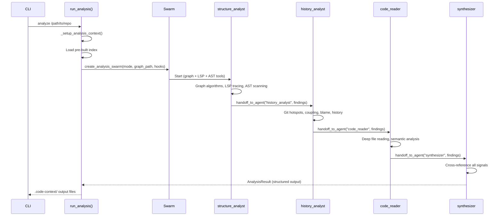

# Swarm Pipeline

v8.0.0 replaced the single-agent analysis with a 4-node Strands Swarm pipeline.
Each node is a specialist agent with a focused tool set and system prompt.
Nodes execute sequentially, handing off findings to the next specialist
until the synthesizer produces the final `AnalysisResult`.

## Pipeline overview



## Node details

| Node | Role | Tools | Focus |
|------|------|-------|-------|
| `structure_analyst` | Structural analysis | `code_graph_analyze`, `code_graph_explore`, `code_graph_export`, `code_graph_stats`, `code_graph_load`, `lsp_start`, `lsp_document_symbols`, `lsp_references`, `lsp_definition`, `lsp_hover`, `lsp_workspace_symbols`, `astgrep_scan`, `astgrep_scan_rule_pack`, `rg_search`, `bm25_search`, `read_file_bounded` | Graph algorithms, LSP semantic analysis, AST patterns |
| `history_analyst` | Git history analysis | `git_hotspots`, `git_files_changed_together`, `git_blame_summary`, `git_file_history`, `git_contributors`, `git_recent_commits`, `rg_search`, `read_file_bounded` | Churn, coupling, ownership, evolution |
| `code_reader` | Deep code reading | `read_file_bounded`, `rg_search`, `bm25_search`, `lsp_references`, `lsp_definition`, `lsp_hover` | Domain concepts, invariants, complexity |
| `synthesizer` | Final synthesis | `write_file`, `code_graph_analyze`, `code_graph_stats`, `read_file_bounded` | Cross-reference signals, produce `AnalysisResult` |

!!! info "Tool specialization is intentional"
    Each node only has access to tools relevant to its phase. The `history_analyst`
    cannot call LSP tools, and the `code_reader` cannot run graph algorithms.
    This prevents tool misuse and keeps each agent focused on its domain.

## Graph preloading

If a pre-built index exists (from `code-context-agent index`), the graph is
loaded into the shared `_graphs["main"]` dict before the Swarm starts. All
nodes can then query it immediately via `code_graph_analyze("main", ...)`.

The code path in `create_analysis_swarm()`:

```
graph_path = output_dir / "code_graph.json"
  -> json.loads(graph_path.read_text())
  -> CodeGraph.from_node_link_data(graph_data)
  -> _graphs["main"] = graph
```

!!! tip "Always run `index` before `analyze`"
    The deterministic indexer builds a graph in ~30 seconds without any LLM calls.
    When the Swarm starts with a preloaded graph, the `structure_analyst` skips
    graph creation entirely and jumps straight to running algorithms -- saving
    significant time and tokens.

## Handoff protocol

Nodes communicate through the Strands Swarm handoff mechanism:

- Each node calls `handoff_to_agent("next_agent", summary, context={...})` when
  its analysis is complete.
- **SharedContext is text-only** -- it is injected into the next agent's prompt
  by `_build_node_input()` inside the Swarm runtime.
- **Nodes execute sequentially** -- there is no parallel execution, which makes
  shared module-level state (like `_graphs`) safe to use without locks.
- **Only the final node** (`synthesizer`) produces structured output via
  `structured_output_model=AnalysisResult`.
- **Completion signal** -- the synthesizer finishes by returning without calling
  `handoff_to_agent`. The Swarm detects this and terminates.

!!! warning "Do not add handoff calls to the synthesizer"
    The synthesizer is the terminal node. If it calls `handoff_to_agent`, the
    Swarm will attempt to route to a non-existent node and fail.

## Swarm configuration

| Parameter | Value | Purpose |
|-----------|-------|---------|
| `max_handoffs` | 10 | Safety bound against infinite handoff loops |
| `max_iterations` | 10 | Maximum execution cycles |
| `execution_timeout` | 1200s (standard) / 3600s (full) | Total Swarm execution time limit |
| `node_timeout` | 300s | Per-node execution time limit |

The timeout is selected based on the analysis mode:

- **Standard mode** (`mode="standard"`): 1200 seconds (20 minutes)
- **Full mode** (`mode="full"` or `mode="full+focus"`): 3600 seconds (60 minutes)

These values come from `Settings.agent_max_duration` and `Settings.full_max_duration`
in the [Configuration](../getting-started/configuration.md) settings.

## Hook integration

Hooks provide observability and quality guardrails for the Swarm pipeline. The
function `create_all_hooks(full_mode=, state=, quiet=)` returns a tuple of
`(agent_hooks, swarm_hooks)`:

- **Agent hooks** are registered on each node's `Agent` instance after Swarm
  creation via `node.executor.hooks.add_hook(hook)`. These include:
    - `ConversationCompactionHook` -- strips large tool payloads from history
    - `OutputQualityHook` -- warns on oversized tool outputs
    - `ToolEfficiencyHook` -- suggests dedicated tools over shell usage
    - `ReasoningCheckpointHook` -- injects reasoning prompts after key tools
    - `FailFastHook` -- raises on tool errors (full mode only)
    - `ToolDisplayHook` or `JsonLogHook` -- display layer

- **Swarm hooks** are registered on the Swarm itself and track node transitions:
    - `SwarmDisplayHook` -- updates `AgentDisplayState` for the Rich TUI
    - `JsonLogSwarmHook` -- emits structured JSON log lines (quiet mode)

See [TUI Phases](tui-phases.md) for details on the Rich dashboard display.

## Why Swarm over single agent

See [ADR-0012](../adr/0012-strands-swarm-multi-agent.md) for the full decision record.

The v8 Swarm architecture replaced the single-agent approach for three reasons:

1. **Context window management** -- A single agent analyzing a large codebase
   accumulates tool results that can overflow its context window. Each Swarm
   node operates in a fresh context, receiving only the distilled findings from
   its predecessor via the handoff summary.

2. **Tool specialization** -- Restricting each node's tool set prevents misuse.
   The `history_analyst` cannot accidentally start an LSP server, and the
   `structure_analyst` cannot run git commands. This produces higher-quality
   signals from each phase.

3. **Signal quality** -- Each specialist deeply explores its domain before
   handing off. The synthesizer then cross-references structural, historical,
   and semantic signals to produce findings with higher confidence than a single
   agent juggling all tools simultaneously.

!!! note "Agents-as-Tools pattern still exists"
    The `analysts.py` module retains the older Agents-as-Tools pattern where
    sub-agents are called as tools by an orchestrator. The Swarm pattern in
    `swarm.py` is the primary pipeline used by `run_analysis()`.
