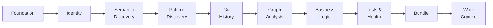

# Phase-Aware TUI

The Rich TUI dashboard tracks analysis progress through 10 ordered phases.
Phase transitions are detected automatically based on tool calls -- each tool
maps to a specific phase via `TOOL_PHASE_MAP`. A live discovery feed surfaces
notable findings as they happen.

---

## Phase Detection

When the agent invokes a tool, the TUI resolves the tool name to a phase using
`resolve_phase()`. Phases only advance forward -- the TUI never regresses to a
lower phase. If the agent uses tools from an earlier phase (e.g., running
`rg_search` during graph analysis), the phase display stays on the current phase.

### The 10 Analysis Phases

| # | Phase | Key Tools | Description |
|---|-------|-----------|-------------|
| 1 | **Foundation** | `create_file_manifest`, `repomix_orientation`, `repomix_compressed_signatures` | File manifest, orientation, signatures |
| 2 | **Identity** | `read_file_bounded` | Project identity and entrypoints |
| 3 | **Semantic Discovery** | `lsp_start`, `lsp_document_symbols`, `lsp_references`, `lsp_definition`, `lsp_hover`, `lsp_workspace_symbols`, `lsp_diagnostics`, `lsp_shutdown` | LSP symbols, references, definitions |
| 4 | **Pattern Discovery** | `astgrep_scan`, `astgrep_scan_rule_pack`, `astgrep_inline_rule` | AST-grep rule packs and patterns |
| 5 | **Git History** | `git_hotspots`, `git_files_changed_together`, `git_blame_summary`, `git_file_history`, `git_contributors`, `git_recent_commits`, `git_diff_file` | Hotspots, coupling, blame, history |
| 6 | **Graph Analysis** | `code_graph_create`, `code_graph_ingest_*`, `code_graph_analyze`, `code_graph_explore`, `code_graph_export`, `code_graph_save`, `code_graph_load`, `code_graph_stats` | Code graph construction and algorithms |
| 7 | **Business Logic** | `write_file_list` | Ranking and categorization |
| 8 | **Tests & Health** | `detect_clones` | Test coverage and code health |
| 9 | **Bundle** | `repomix_bundle`, `repomix_bundle_with_context`, `repomix_split_bundle`, `repomix_json_export` | Source code bundling |
| 10 | **Write Context** | `write_file` | CONTEXT.md generation |

---

## Discovery Feed

The TUI shows a live feed of notable discoveries made during analysis. Discovery
events are extracted from tool results by `_extract_discovery()` in the Rich
consumer.

### Discovery Event Kinds

| Kind | Triggered By | Example |
|------|--------------|---------|
| `FILES_DISCOVERED` | `create_file_manifest` | "Found 847 files" |
| `SYMBOLS_FOUND` | `lsp_document_symbols`, `lsp_workspace_symbols` | "Found 42 symbols" |
| `HOTSPOTS_IDENTIFIED` | `git_hotspots` | "Identified 15 hotspots" |
| `PATTERNS_MATCHED` | `astgrep_scan`, `astgrep_scan_rule_pack` | "Matched 23 patterns" |
| `MODULES_DETECTED` | `code_graph_analyze` | "Detected 8 modules" |
| `GRAPH_BUILT` | `code_graph_create` | "Code graph initialized" |

The feed shows the 3 most recent discoveries. Old events are evicted from a
capped list (max 50 events).

---

## TUI Dashboard Layout

The dashboard panel displays the following sections from top to bottom:

1. **Timer + progress bar** -- elapsed time and turn count vs configured limits
2. **Phase indicator** -- `[N/10] Phase Name (description)`
3. **Tool summary** -- total/success/error counts with category breakdown and mini bars
4. **Discovery feed** -- last 3 notable findings with diamond bullet markers
5. **Active tool spinner** -- currently executing tool with elapsed time
6. **Recent tools** -- last 8 completed tools with status icons
7. **Mode badge** -- panel title shows `Code Context Agent [FULL]` when in full mode

!!! info "Dashboard updates"
    The dashboard refreshes on every AG-UI event from the Strands agent. Phase
    transitions and discovery events are processed inline as tool-start and
    tool-end events arrive.

---

## Implementation

| Component | Source | Responsibilities |
|-----------|--------|------------------|
| Phase model | `consumer/phases.py` | `AnalysisPhase(IntEnum)`, `TOOL_PHASE_MAP`, `resolve_phase()` |
| Discovery events | `consumer/phases.py` | `DiscoveryEvent(FrozenModel)`, `DiscoveryEventKind(StrEnum)` |
| Phase state | `consumer/state.py` | `AgentDisplayState.advance_phase()`, `add_discovery()` |
| TUI rendering | `consumer/rich_consumer.py` | `_detect_phase()`, `_extract_discovery()`, `_build_phase_indicator()`, `_build_discovery_feed()` |

### Adding a New Phase

To add a new analysis phase:

1. Add the phase to `AnalysisPhase` in `consumer/phases.py` with the correct ordinal
2. Map the relevant tool names to the new phase in `TOOL_PHASE_MAP`
3. Optionally add a `DiscoveryEventKind` if the phase produces notable findings
4. The TUI rendering picks up the new phase automatically via `resolve_phase()`

### Adding a Discovery Event

To surface a new kind of discovery:

1. Add the kind to `DiscoveryEventKind` in `consumer/phases.py`
2. Add extraction logic in `_extract_discovery()` in `consumer/rich_consumer.py`
3. The feed displays it automatically via `_build_discovery_feed()`
