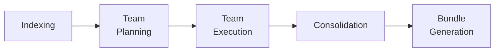

# Phase-Aware TUI

The Rich TUI dashboard tracks analysis progress through 5 ordered phases.
Phase transitions are detected automatically based on tool calls -- each tool
maps to a specific phase via `TOOL_PHASE_MAP`. A live discovery feed surfaces
notable findings as they happen.

---

## Phase Detection

When the agent invokes a tool, the TUI resolves the tool name to a phase using
`resolve_phase()`. Phases only advance forward -- the TUI never regresses to a
lower phase. If the agent uses tools from an earlier phase, the phase display
stays on the current phase.

### The 5 Analysis Phases

| # | Phase | Key Tools | Description |
|---|-------|-----------|-------------|
| 1 | **Indexing** | (deterministic pipeline, no agent tools) | Deterministic code indexing (no LLM) |
| 2 | **Team Planning** | `read_heuristic_summary` | Reading heuristic summary, planning teams |
| 3 | **Team Execution** | `dispatch_team`, `rg_search`, `bm25_search`, `read_file_bounded`, `git_hotspots`, `git_files_changed_together`, `git_blame_summary`, `git_file_history`, `git_contributors`, `git_recent_commits`, `git_diff_file`, `gitnexus_*`, `context7_*`, `shell`, all repomix/discovery tools | Parallel specialist teams analyzing code |
| 4 | **Consolidation** | `read_team_findings` | Reading and cross-referencing team findings |
| 5 | **Bundle Generation** | `write_bundle` | Writing narrative bundles and CONTEXT.md |

---

## Discovery Feed

The TUI shows a live feed of notable discoveries made during analysis. Discovery
events are extracted from tool results by `_extract_discovery()` in the Rich
consumer.

### Discovery Event Kinds

| Kind | Triggered By | Example |
|------|--------------|---------|
| `FILES_DISCOVERED` | `create_file_manifest` | "Found 847 files" |
| `HOTSPOTS_IDENTIFIED` | `git_hotspots` | "Identified 15 hotspots" |

The feed shows the 3 most recent discoveries. Old events are evicted from a
capped list (max 50 events).

---

## TUI Dashboard Layout

The dashboard panel displays the following sections from top to bottom:

1. **Timer + progress bar** -- elapsed time and turn count vs configured limits
2. **Phase indicator** -- `[N/5] Phase Name (description)`
3. **Tool summary** -- total/success/error counts with category breakdown and mini bars
4. **Discovery feed** -- last 3 notable findings with diamond bullet markers
5. **Active tool spinner** -- currently executing tool with elapsed time
6. **Recent tools** -- last 8 completed tools with status icons
7. **Mode badge** -- panel title shows `Code Context Agent [FULL]` when in full mode

!!! info "Dashboard updates"
    The dashboard uses Rich `Live` with a 2fps refresh rate. `ToolDisplayHook`
    updates `AgentDisplayState` on tool start/end events, while `SwarmDisplayHook`
    tracks agent transitions. Phase detection and discovery extraction happen
    within these hook callbacks.

---

## Implementation

| Component | Source | Responsibilities |
|-----------|--------|------------------|
| Phase model | `consumer/phases.py` | `AnalysisPhase(IntEnum)`, `TOOL_PHASE_MAP`, `resolve_phase()` |
| Discovery events | `consumer/phases.py` | `DiscoveryEvent(FrozenModel)`, `DiscoveryEventKind(StrEnum)` |
| Phase state | `consumer/state.py` | `AgentDisplayState.advance_phase()`, `add_discovery()` |
| Tool display hook | `agent/hooks.py` | `ToolDisplayHook` -- updates `AgentDisplayState` on tool start/end |
| Swarm display hook | `agent/hooks.py` | `SwarmDisplayHook` -- tracks Swarm node transitions for active agent display |
| TUI rendering | `consumer/rich_consumer.py` | Reads from `AgentDisplayState` (which hooks update); `_build_phase_indicator()`, `_build_discovery_feed()` |

### Adding a New Phase

To add a new analysis phase:

1. Add the phase to `AnalysisPhase` in `consumer/phases.py` with the correct ordinal
2. Map the relevant tool names to the new phase in `TOOL_PHASE_MAP`
3. Optionally add a `DiscoveryEventKind` if the phase produces notable findings
4. The TUI rendering picks up the new phase automatically via `resolve_phase()`

### Adding a Discovery Event

To surface a new kind of discovery:

1. Add the kind to `DiscoveryEventKind` in `consumer/phases.py`
2. Add extraction logic in `_extract_discovery()` in `consumer/rich_consumer.py`
3. The feed displays it automatically via `_build_discovery_feed()`
