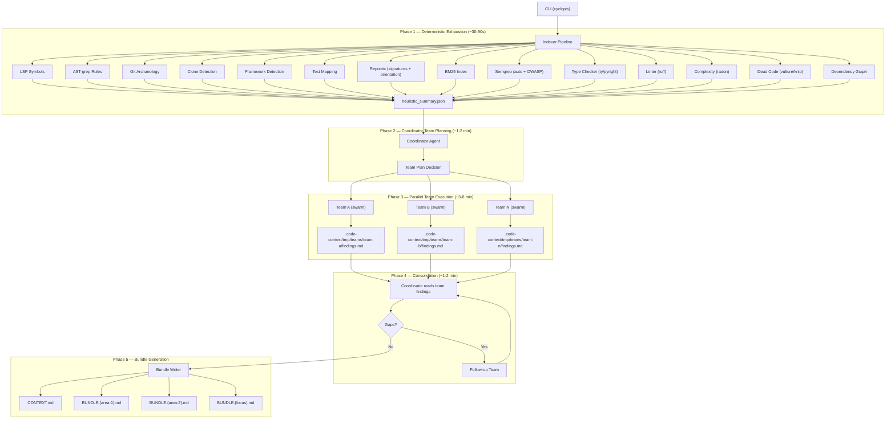
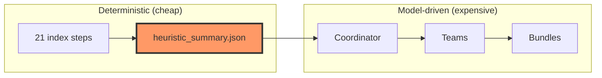
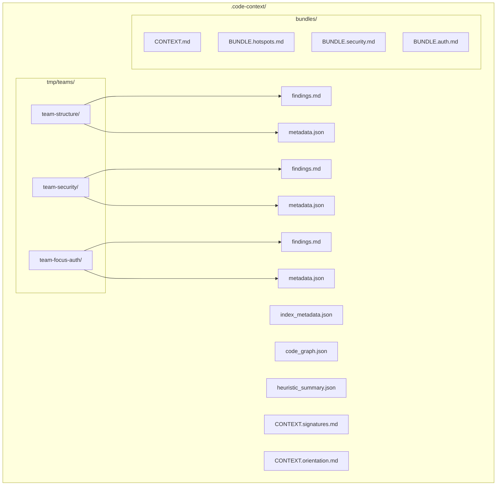
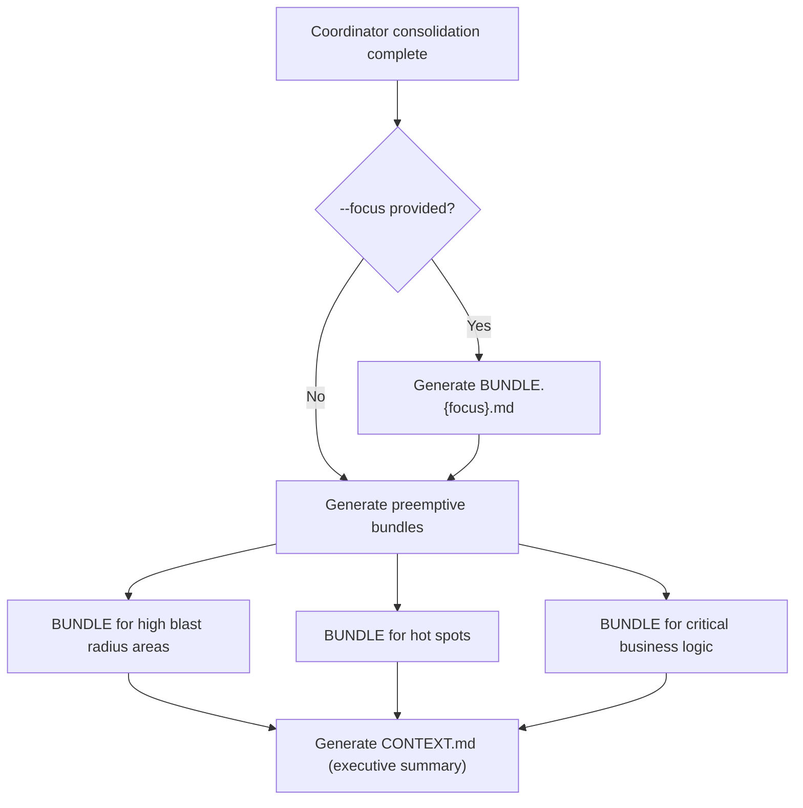

# Progressive Disclosure: The 5-Phase Code Intelligence Pipeline

## Design Tenet

**Progressive disclosure**: exhaust deterministic, pattern-based, and structural
analysis before spending a single LLM token. Every dollar of model inference
should be spent on reasoning that static tools cannot perform — narrative
synthesis, business logic interpretation, risk judgment, and cross-cutting
insight correlation.

## Architecture Overview



## Phase 1: Deterministic Exhaustion (~30-90s)

Run every tool that requires zero LLM inference. These tools operate on pattern
matching, AST traversal, graph algorithms, and git archaeology. All outputs land
in `.code-context/` as structured JSON or markdown artifacts.

### Currently implemented (`indexer.py` Steps 1-13):

| Step | Tool | Output |
|------|------|--------|
| 1 | ripgrep `--files` | `files.all.txt` |
| 2 | Extension mapping | Language groups |
| 3 | LSP `documentSymbols` | Graph nodes/edges |
| 4 | AST-grep rule packs | Graph nodes (business logic, code smells) |
| 5 | `git log` frequency | Graph hotspot nodes |
| 6 | `git show` per-hotspot | Graph co-change edges |
| 7 | `jscpd` | Graph clone edges |
| 8 | Extension + file heuristics | Framework list + entry point scoring |
| 9 | Filename conventions | Graph test→production edges |
| 10 | `repomix --compress` | `CONTEXT.signatures.md` |
| 11 | `repomix --no-files --token-count-tree` | `CONTEXT.orientation.md` |
| 12 | `rank_bm25` | In-memory BM25 index |
| 13 | `CodeAnalyzer` | `index_metadata.json` |

### Proposed additions:

| Step | Tool | Output artifact | What it captures |
|------|------|----------------|-----------------|
| 14 | `semgrep --config auto` | `semgrep_auto.json` | General quality, anti-patterns, security smells |
| 15 | `semgrep --config p/owasp-top-ten` | `semgrep_owasp.json` | OWASP Top 10 vulnerability matches |
| 16 | `ty check --output-format json` / `pyright` | `typecheck.json` | Type errors, missing annotations, inference gaps |
| 17 | `ruff check --output-format json` | `lint.json` | Style violations, complexity warnings, import issues |
| 18 | `radon cc -j` | `complexity.json` | Cyclomatic complexity per function |
| 19 | `vulture` | `dead_code_py.json` | Unused functions, classes, imports, variables |
| 20 | `knip --reporter json` | `dead_code_ts.json` | Unused exports, dependencies, files, types |
| 21 | `pipdeptree --json` / `npm ls --json` | `deps.json` | Direct + transitive dependency tree |

Each tool follows the existing pattern: `shutil.which()` → `subprocess.run()`
→ parse structured output → ingest into graph and/or write artifact. Failures
are graceful — skip and continue.

### Heuristic Summary: The Progressive Disclosure Boundary

After all deterministic tools complete, generate `heuristic_summary.json` — the
**only** artifact the coordinator reads before making its team-planning decision.
It is the narrowest possible surface that lets the coordinator decide depth and
breadth without reading source code.



**Structure:**

```json
{
  "volume": {
    "total_files": 1847,
    "total_lines": 142000,
    "estimated_tokens": 35500000,
    "languages": {"py": 1200, "ts": 500, "go": 147},
    "frameworks": ["fastapi", "react", "sqlalchemy"]
  },
  "symbols": {
    "functions": 3200,
    "classes": 480,
    "modules": 95,
    "top_complex_functions": [
      {"name": "process_order", "file": "src/orders/engine.py", "lines": "142-298", "complexity": 34}
    ]
  },
  "health": {
    "semgrep_findings": {"critical": 2, "high": 14, "medium": 47},
    "owasp_findings": {"sql_injection": 1, "xss": 3},
    "type_errors": 23,
    "lint_violations": 156,
    "dead_code_symbols": 89,
    "clone_groups": 12,
    "avg_cyclomatic_complexity": 6.2
  },
  "topology": {
    "graph_nodes": 6400,
    "graph_edges": 18200,
    "connected_components": 3,
    "max_fan_in": {"node": "src/db/session.py:get_db", "count": 147},
    "max_fan_out": {"node": "src/api/router.py:app", "count": 52},
    "entry_points": ["src/main.py:app (score: 0.95)"],
    "hotspots": ["src/orders/engine.py (87 commits)"],
    "bus_factor_risks": ["src/billing/ (1 contributor, 40 files)"]
  },
  "git": {
    "total_commits_analyzed": 200,
    "active_contributors": 12,
    "most_coupled_pairs": [
      {"a": "src/orders/engine.py", "b": "src/orders/models.py", "coupling": 0.89}
    ]
  }
}
```

## Phase 2: Coordinator Team Planning (model-driven, ~1-2 min)

The coordinator agent receives `heuristic_summary.json` and the user's optional
`--focus` argument.

### Key design principle: tools teach themselves

The coordinator prompt stays lean. Instead of embedding agent spec templates,
tool usage rules, and dispatch instructions in the system prompt, those
behaviors live in **tool docstrings**:

- A `@tool`-decorated `dispatch_team` wrapper (around `strands_tools.swarm`)
  carries its own description of team sizing, agent specs, and dispatch patterns
- A `@tool`-decorated `read_team_findings` carries its own description of how
  to read and interpret team results
- A `@tool`-decorated `write_bundle` carries its own description of bundle
  structure and format

The coordinator prompt provides only: identity, pre-computed heuristic summary,
the user's focus (if any), and the goal (produce bundles). The tools guide the
how.

### Decision inputs (available in heuristic summary):

- **Volume metrics** — file count, token count, language count → breadth
- **Health signals** — semgrep criticals, OWASP findings, high complexity → mandatory targets
- **Topology signals** — fan-in/fan-out extremes, bus factor risks, coupled pairs → structural hotspots
- **Focus argument** — if provided, guarantees at least one dedicated team

### Decision outputs (per team):

- **Team ID** (e.g., `team-structure`, `team-security`, `team-focus-auth`)
- **Mandate** — what to investigate and why
- **File scope** — specific files/directories/modules
- **Tool subset** — which tools this team needs
- **Key questions** — what the coordinator wants answered
- **Artifact pointers** — which Phase 1 artifacts to consult

## Phase 3: Team Execution (parallel, ~3-8 min)

Each team executes as a Swarm (2-3 agents) dispatched via `dispatch_team`. Teams
run in parallel via `ConcurrentToolExecutor`.

### What teams do that deterministic tools cannot:

- **Read actual source code** and understand business domain semantics
- **Correlate findings** across tools (a high-complexity function that is also a
  git hotspot AND has a semgrep finding is a critical risk)
- **Identify implicit contracts** not captured by type systems or call graphs
- **Assess architectural intent** vs. implementation reality
- **Produce narrative explanations** of why code exists and what it does

### Team result persistence:



File-based handoff (vs. passing results through swarm return values) enables:

- Findings persist even if a team times out or errors
- Coordinator reads findings incrementally
- Results are inspectable by the user during execution
- Future runs can diff against previous team findings

## Phase 4: Coordinator Consolidation (model-driven, ~1-2 min)

The coordinator reads all team result files via `read_team_findings`.

1. **Cross-reference** — where do multiple teams agree? (high confidence) Where
   do they disagree or leave gaps? (needs follow-up)
2. **Synthesis** — merge structural + historical + security + business logic
3. **Follow-up dispatch** — if critical gaps remain, dispatch one targeted team
4. **Bundle planning** — decide what bundles to produce

## Phase 5: Bundle Generation

A **bundle** is a self-contained narrative document about a specific area of the
codebase, written for a developer who needs to work in that area.

### Bundle selection logic:



**If `--focus` was specified:** guaranteed bundle for the focus area that answers
"I need to change X — what do I need to know?" with blast radius analysis.

**Always (regardless of focus):** preemptive bundles for:

1. **High blast radius areas** — extreme fan-in/fan-out nodes
2. **Hot spots** — high churn + high complexity + multiple contributors
3. **Critical business logic** — core domain operations (not framework glue)

### Bundle format:

Each `BUNDLE.{area}.md` follows a consistent structure:

1. **One-paragraph summary** — what this area does in business terms
2. **Key files** — ranked list with role descriptions and line ranges
3. **Call flow** — how data/control flows through this area
4. **Blast radius** — what breaks if you change this area
5. **Risk assessment** — security, complexity, coupling, test coverage
6. **Change guidance** — where to start, what to watch out for
7. **Git context** — ownership, churn frequency, implicit coupling

### Output layout:

```
.code-context/
  CONTEXT.md                    # Executive summary + cross-cutting narrative
  heuristic_summary.json        # Phase 1 bridge artifact
  index_metadata.json           # Graph stats, entry points, hotspots
  code_graph.json               # Full graph
  CONTEXT.signatures.md         # Compressed source (repomix)
  CONTEXT.orientation.md        # Token-aware overview (repomix)
  bundles/
    BUNDLE.{area-1}.md          # Per-area deep-dive narrative
    BUNDLE.{area-2}.md
    BUNDLE.{focus}.md           # Guaranteed if --focus provided
  tmp/
    teams/
      {team-id}/
        findings.md             # Raw team narrative
        metadata.json           # Stats: files read, tools used, duration
```

## Design Constraints

### Tools teach themselves

Agent system prompts stay lean. Tool behavior, usage patterns, and parameter
semantics live in `@tool` docstrings — not in the coordinator prompt. This means:

- **`dispatch_team`** — a `@tool`-decorated wrapper around `strands_tools.swarm`
  whose docstring describes team sizing heuristics, agent spec format, tool
  inheritance, and dispatch patterns
- **`read_team_findings`** — a `@tool`-decorated reader whose docstring
  describes the team result directory structure and how to interpret findings
- **`write_bundle`** — a `@tool`-decorated writer whose docstring describes
  bundle structure, format, and naming conventions
- **`read_heuristic_summary`** — a `@tool`-decorated reader whose docstring
  describes the heuristic summary schema and how to interpret each section

The coordinator prompt provides: identity, the heuristic summary data, the
user's focus (if any), and the goal. The tools guide the how.

### Never prescribe tool call counts

Agent prompts never say "make 2-5 tool calls" or "use at most 3 queries." The
agent decides how many calls it needs based on the data. Prescribing counts
leads to either premature stopping or wasteful padding.

### Mermaid over ASCII

All diagrams in markdown outputs use Mermaid code-fenced blocks. Never ASCII
art.

## What Changes from the Current System

| Component | Change |
|-----------|--------|
| `indexer.py` | Add steps 14-21 (semgrep, typecheck, lint, complexity, dead code, deps) + `heuristic_summary.json` generation |
| `coordinator.md.j2` | Rewrite: lean prompt, remove agent spec templates and tool usage rules, reference heuristic summary |
| `coordinator.py` | Minimal changes — already creates Agent with swarm + all tools |
| `models/output.py` | Add `Bundle` model, add `bundles: list[Bundle]` to `AnalysisResult` |
| New: `tools/coordinator_tools.py` | `dispatch_team`, `read_team_findings`, `write_bundle`, `read_heuristic_summary` — `@tool`-decorated wrappers with rich docstrings |
| `runner.py` | Ensure team result dirs created before dispatch |
| CLI | `--focus` already exists; add `--bundles-only` for re-running Phase 5 |

## What Does NOT Change

- Graph model, graph tools, graph storage
- LSP tools, AST-grep tools, git tools
- Discovery tools (ripgrep, repomix)
- BM25 search
- MCP server (serves whatever artifacts exist)
- Hook system (display hooks work at coordinator level)
