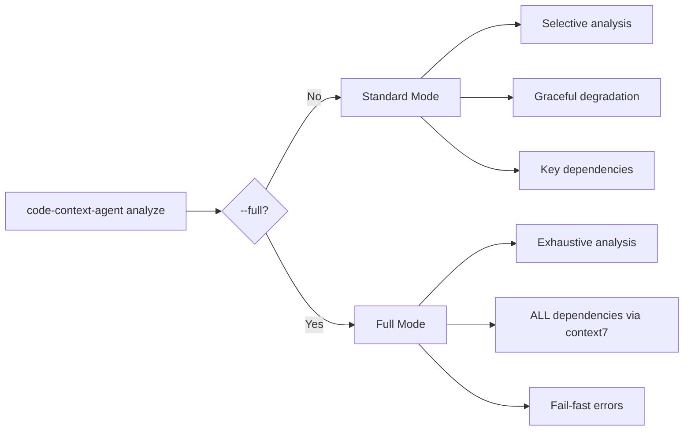

# Full Mode

## Overview

The `--full` flag runs an exhaustive analysis with no size limits. It was introduced in v7.0.0 for cases where complete coverage matters more than speed.

- **Standard mode** (default): Selective analysis with graceful degradation on tool errors
- **Full mode**: Exhaustive analysis, all dependencies looked up via context7, fail-fast on errors



## Usage

```bash
# Exhaustive analysis of a repository
code-context-agent analyze /path/to/repo --full

# Full mode with a focus area
code-context-agent analyze . --full --focus "authentication"
```

## What Changes in Full Mode

| Aspect | Standard | Full |
|--------|----------|------|
| Duration limit | 20 min (1200s) | 60 min (3600s) |
| Turn limit | 1000 | 3000 |
| Team execution timeout | 900s | 2400s |
| Team node timeout | 900s | 1800s |
| context7 | Key dependencies | ALL dependencies |
| Error handling | Graceful degradation | Fail-fast (`FailFastHook`) |
| Output | CONTEXT.md + bundles | Same, with extended analysis depth |

## Fail-Fast Error Handling

In full mode, the `FailFastHook` monitors every tool invocation. When a non-exempt tool returns an error, the hook raises `FullModeToolError` and halts the analysis immediately.

This prevents silently degraded results -- you get all signals or a clear failure.

### Exempt tools

The following tools are allowed to fail without triggering a halt:

| Tool | Reason |
|------|--------|
| `rg_search` | Search misses are expected |
| `context7_*` | External MCP service, best-effort |
| `gitnexus_*` | External MCP service, best-effort |
| `shell` | Exploratory commands may fail |

All other tool errors are treated as fatal in full mode.

## Additional Output

Full mode uses the same output structure as standard mode (`CONTEXT.md`, `bundles/BUNDLE.{area}.md`, etc.) but with extended analysis depth, more teams dispatched, and all dependencies looked up via context7. The increased turn and duration limits allow the coordinator to dispatch more investigation teams and produce richer bundle content.

All files are written to `.code-context/` (or your custom `--output-dir`).

## Configuration

Full mode overrides the standard duration and turn limits. These can be tuned via environment variables:

| Variable | Default | Description |
|----------|---------|-------------|
| `CODE_CONTEXT_FULL_MAX_DURATION` | `3600` | Max duration for full mode in seconds (range: 300--14400) |
| `CODE_CONTEXT_FULL_MAX_TURNS` | `3000` | Max agent turns for full mode (range: 100--10000) |

```bash
# Example: allow up to 2 hours for a very large codebase
export CODE_CONTEXT_FULL_MAX_DURATION=7200
export CODE_CONTEXT_FULL_MAX_TURNS=5000
code-context-agent analyze /path/to/monorepo --full
```

## Flag Combinations

`--full` can be combined with some flags but not others:

| Combination | Result |
|-------------|--------|
| `--full --focus "area"` | Exhaustive analysis scoped to a specific area (mode: `full+focus`) |
| `--full --since REF` | **Not allowed** -- mutually exclusive, raises an error |

The `--since` flag produces a delta analysis (changes since a ref), which is fundamentally incompatible with the exhaustive nature of full mode.

## When to Use Full Mode

!!! tip "Use full mode when..."
    - You need complete coverage of a large or complex codebase
    - You want context7 to look up documentation for ALL detected dependencies
    - You want more investigation teams dispatched with longer timeouts
    - You need fail-fast error handling (no silent degradation)

!!! warning "Cost and time"
    Full mode uses significantly more tokens and time than standard mode. A typical full analysis runs 30--60 minutes and consumes 500K--2M tokens. Use standard mode for iterative work and reserve full mode for comprehensive one-time analysis.
