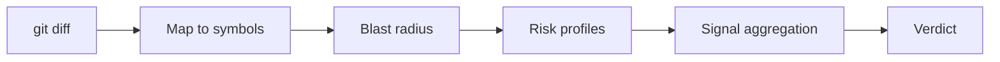

# Verdict Command

The `verdict` command computes a deterministic, machine-readable change verdict for a git diff against pre-computed codebase context. It runs in under 60 seconds with zero LLM calls, making it suitable for CI/CD pipelines.

## How It Works

The verdict engine follows a five-step pipeline:

1. **git diff** — Identify changed files between `--base` and `--head`
2. **GitNexus cypher** — Map changed files to symbols and communities in the code graph
3. **GitNexus impact** — Compute blast radius (upstream dependents) for high-risk symbols
4. **Risk profile matching** — Cross-reference changes against per-area risk profiles from the last full analysis
5. **Signal aggregation** — Combine all signals into a composite verdict with calibrated confidence



!!! warning "Prerequisite"
    The verdict command requires a `.code-context/` directory from a prior `index` or `analyze` run. Without it, the engine has no pre-computed context to evaluate against.

## Usage

```bash
code-context-agent verdict [PATH] [OPTIONS]
```

### Arguments

| Argument | Default | Description |
|----------|---------|-------------|
| `PATH` | `.` (current directory) | Path to the repository |

### Options

| Option | Default | Description |
|--------|---------|-------------|
| `--base` | `main` | Base git ref for the diff (e.g., `main`, `origin/main`) |
| `--head` | `HEAD` | Head git ref for the diff (e.g., `HEAD`, branch name) |
| `--output-format` | `human` | Output format: `json` (machine-readable) or `human` (rich terminal) |
| `--exit-code` | `false` | Use exit codes for CI/CD integration |

### Examples

```bash
# Basic usage — compare current branch against main
code-context-agent verdict .

# Compare against a specific base branch
code-context-agent verdict . --base origin/develop

# JSON output for CI/CD consumption
code-context-agent verdict . --base main --output-format json

# CI/CD mode with exit codes
code-context-agent verdict . --base main --output-format json --exit-code
```

## Verdict Tiers

The engine produces one of five verdict tiers, ordered from least to most restrictive:

| Tier | Exit Code | Meaning |
|------|-----------|---------|
| `auto_merge` | 0 | Safe to merge without additional review |
| `single_review` | 1 | Needs one reviewer |
| `dual_review` | 1 | Needs two reviewers |
| `expert_review` | 2 | Needs domain expert review |
| `block` | 3 | Should not be merged — critical issues detected |

Exit code `4` indicates an error in the verdict computation itself.

## Signal Types

The verdict is composed from multiple independent signals, each with a severity level:

| Signal Type | Description |
|-------------|-------------|
| `blast_radius` | Number of upstream dependents affected by changed symbols |
| `churn_rate` | Changed files that are top-10 git hotspots |
| `bus_factor` | Changes touch areas with a single contributor |
| `test_gap` | New/modified code paths without test coverage |
| `security_finding` | Semgrep critical or high-severity findings in the repo |
| `pattern_violation` | Known architectural pattern violations |
| `cross_community` | Changes span multiple GitNexus communities |
| `ownership_gap` | No clear code owner for changed files |
| `complexity_spike` | Area has an accelerating or degrading risk trend |

Each signal has a severity of `info`, `warning`, `escalation`, or `block`:

- **block** signals immediately set the verdict to `block`
- **escalation** signals each push the verdict up one tier
- **warning** signals push up by half a tier (two warnings = one tier escalation)

## JSON Output

When using `--output-format json`, the verdict command writes a `VerdictResponse` object:

```json
{
  "verdict": {
    "verdict": "single_review",
    "confidence": 0.85,
    "affected_symbols": ["validate_token", "AuthMiddleware"],
    "affected_communities": ["Authentication"],
    "affected_processes": ["login-flow", "api-auth"],
    "blast_radius": 12,
    "signals": [
      {
        "signal_type": "blast_radius",
        "severity": "warning",
        "description": "12 upstream dependents across 2 changed symbols",
        "source": "gitnexus_impact",
        "weight": 0.24
      }
    ],
    "escalation_reasons": [],
    "reasoning_chain": [
      "1. Diff: 3 files changed (main..HEAD)",
      "2. Blast radius: 12 total upstream dependents",
      "3. Single community: Authentication",
      "VERDICT: single_review (confidence=0.85, freshness=current, penalty=0.0)"
    ],
    "decision_boundary": {
      "current_verdict": "single_review",
      "next_higher_verdict": "dual_review",
      "distance": 0.3,
      "escalation_triggers": ["Additional bus factor risk would escalate"],
      "de_escalation_triggers": ["Adding tests for hotspot files"]
    },
    "recommended_reviewers": [
      {"identity": "alice <alice@example.com>", "reason": "recent_contributor", "confidence": 0.9}
    ],
    "files_changed": ["src/auth/token.py", "src/auth/middleware.py", "tests/test_auth.py"]
  },
  "index_freshness": {
    "last_full_analysis": "2026-04-05T01:00:00+00:00",
    "freshness": "current",
    "confidence_penalty": 0.0
  },
  "exit_code": 1,
  "should_block": false,
  "review_comment_markdown": "## Code Context Verdict: `single_review`\n...",
  "github_labels": []
}
```

## Decision Boundary Transparency

Each verdict includes a `decision_boundary` field that shows how close the verdict is to flipping to the next tier. This gives teams visibility into marginal decisions:

- **distance** (0.0-1.0): How close to the next tier. 0.0 = firmly in the current tier, 1.0 = about to flip.
- **escalation_triggers**: What would push the verdict to a more restrictive tier.
- **de_escalation_triggers**: What would relax the verdict (e.g., adding tests, narrowing the diff scope).

## Index Freshness

The verdict engine checks how current the pre-computed analysis is:

| Freshness | Age | Confidence Penalty |
|-----------|-----|--------------------|
| `current` | < 48 hours | 0.0 |
| `stale` | 48 hours - 7 days | -0.15 |
| `outdated` | > 7 days | -0.30 |

!!! tip
    If the index is `outdated`, the verdict automatically escalates to at least `single_review` regardless of other signals. Re-run `code-context-agent index` to refresh.

## CI/CD Integration

The verdict command is designed for pipeline consumption. Use `--exit-code` to fail the pipeline based on the verdict tier. See the [CI Init](ci-init.md) guide for ready-to-use workflow templates.

### PR Comment

The `review_comment_markdown` field contains a pre-formatted PR comment. It includes the verdict, signals, escalation reasons, recommended reviewers, and borderline verdicts.

### GitHub Labels

The `github_labels` field suggests labels to apply to the PR:

| Label | Condition |
|-------|-----------|
| `auto-approvable` | Verdict is `auto_merge` |
| `blocked` | Verdict is `block` |
| `needs-security-review` | Security findings in signals |
| `bus-factor-risk` | Bus factor signals detected |
| `high-blast-radius` | Blast radius exceeds 20 |
| `cross-cutting` | Changes span more than 2 communities |
