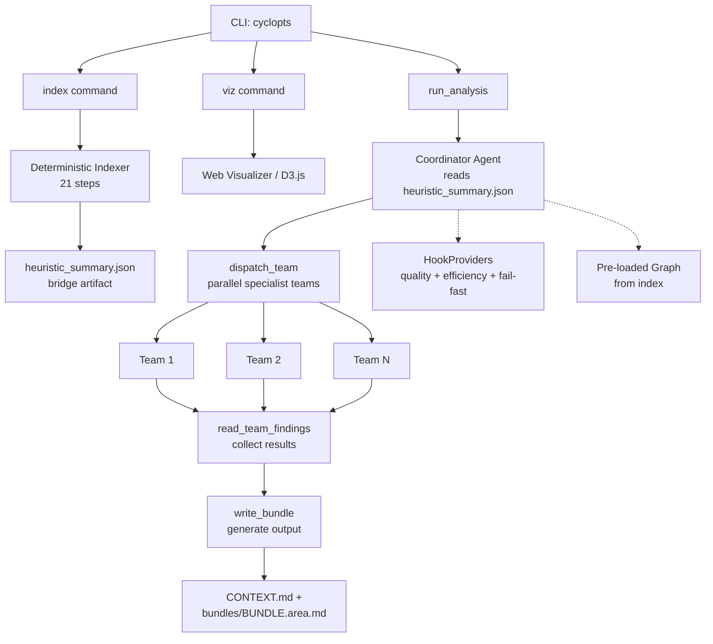

# code-context-agent

**AI-powered CLI tool for automated codebase analysis and context generation.**

`code-context-agent` uses Claude Opus 4.6 (via Amazon Bedrock) with 52+ tools to analyze unfamiliar codebases and produce structured context documentation for AI coding assistants. It combines semantic analysis (LSP), structural pattern matching (ast-grep), graph algorithms (NetworkX/KuzuDB), BM25 ranked search, git history analysis, and intelligent code bundling (repomix) to generate narrated markdown that helps developers and AI assistants understand a codebase's architecture and business logic.

!!! warning "Autonomous Agent"
    This CLI runs a **fully autonomous AI agent loop**. The agent decides which tools to invoke, what files to read, and what shell commands to run. While shell commands are restricted to a read-only allowlist and all inputs are validated, the agent makes its own decisions within those bounds. **Review all generated output before using it in production.**

!!! info "AI-Generated Output"
    **Generative AI can make mistakes.** Review all output and monitor costs generated by your chosen AI model. Analysis of a single repository typically consumes 50K--500K input tokens and 10K--50K output tokens on Claude Opus 4.6.

!!! note "Disclaimer"
    The author is an AWS employee. This is **not** an official AWS project or service. It is not maintained, supported, or endorsed by AWS. This project runs fully autonomous agent loops with access to your filesystem (read-only). You are solely responsible for any consequences of running this tool. The CLI and source code are provided **AS IS** without warranty of any kind. **User discretion advised.**

---

## Key Capabilities

| Capability | Description |
|------------|-------------|
| **52+ analysis tools** | LSP, ast-grep, ripgrep, BM25 search, repomix, git history, NetworkX/KuzuDB graph |
| **Multi-language LSP** | Python (ty), TypeScript, Rust, Go, Java with ordered fallback chains |
| **Graph-based insights** | Hotspots, foundations (PageRank/TrustRank), modules (Louvain/Leiden), blast radius, execution flows, diff impact, framework detection |
| **BM25 ranked search** | Concept-level search with TF-IDF-like relevance scoring |
| **Git-aware bundling** | Embeds diffs, commit history, and coupling data in context bundles |
| **Tree-sitter compression** | Extracts signatures/types only, stripping function bodies for token efficiency |
| **Structured output** | Pydantic-typed `AnalysisResult` with ranked business logic, risks, and graph stats |
| **Security hardened** | Shell allowlist, input validation, path traversal prevention, CI security pipeline |
| **Full mode** | `--full` for exhaustive analysis with no size limits, fail-fast errors, and per-module output |
| **Deterministic indexer** | `index` command builds code graphs without LLM calls (fast, cheap) |
| **Web visualization** | `viz` command launches interactive D3.js graph exploration |
| **MCP server** | Graph algorithms, diff impact, multi-repo registry, Cypher queries, and analysis as MCP tools |
| **KuzuDB backend** | Optional persistent graph storage with Cypher query support |

---

## Architecture



---

## Quick Start

```bash
# Install
uv tool install code-context-agent

# Analyze a repository
code-context-agent analyze /path/to/repo

# Focus on a specific area
code-context-agent analyze . --focus "authentication system"

# Verify tool dependencies
code-context-agent check

# Exhaustive analysis (no size limits, fail-fast)
code-context-agent analyze . --full

# Quick index without LLM (fast, cheap)
code-context-agent index .

# Interactive visualization
code-context-agent viz .
```

See the [Installation](getting-started/installation.md) and [Quick Start](getting-started/quickstart.md) guides for details.

---

## Output

All outputs are written to `.code-context/` (or custom `--output-dir`):

| File | Description |
|------|-------------|
| `CONTEXT.md` | Main narrated context (<=300 lines in standard mode) |
| `bundles/BUNDLE.{area}.md` | Targeted narrative bundles per investigation area |
| `CONTEXT.orientation.md` | Token distribution tree |
| `CONTEXT.bundle.md` | Bundled source code (compressed) |
| `CONTEXT.signatures.md` | Signatures-only structural view |
| `files.all.txt` | Complete file manifest |
| `files.business.txt` | Curated business logic files |
| `code_graph.json` | Persisted graph data |
| `heuristic_summary.json` | Bridge artifact between indexer and coordinator |
| `FILE_INDEX.md` | File index with graph metrics (complex repos) |
| `analysis_result.json` | Structured analysis result (Pydantic JSON) |
| `CONTEXT.modules/` | Per-module context files (full mode) |

---

## Tech Stack

| Component | Technology |
|-----------|-----------|
| Agent framework | [Strands Agents](https://github.com/strands-agents/sdk-python) |
| LLM | Claude Opus 4.6 via Amazon Bedrock |
| CLI | [cyclopts](https://cyclopts.readthedocs.io/) |
| Prompt templates | Jinja2 |
| Data models | Pydantic + pydantic-settings |
| Graph analysis | NetworkX + KuzuDB (optional persistent backend) |
| Ranked search | BM25 (rank_bm25) |
| Terminal UI | Rich |
| Web visualization | D3.js |
| Code search | ripgrep |
| Code bundling | repomix (Tree-sitter) |
| Pattern matching | ast-grep |
| Type checker / LSP | ty, typescript-language-server |
