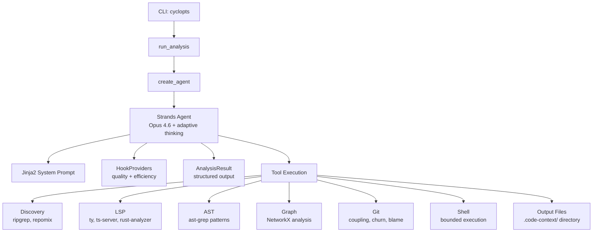

# code-context-agent

**AI-powered CLI tool for automated codebase analysis and context generation.**

`code-context-agent` uses Claude Opus 4.6 (via Amazon Bedrock) with 40+ tools to analyze unfamiliar codebases and produce structured context documentation for AI coding assistants. It combines semantic analysis (LSP), structural pattern matching (ast-grep), graph algorithms (NetworkX), git history analysis, and intelligent code bundling (repomix) to generate narrated markdown that helps developers and AI assistants understand a codebase's architecture and business logic.

---

## Key Capabilities

| Capability | Description |
|------------|-------------|
| **40+ analysis tools** | LSP, ast-grep, ripgrep, repomix, git history, NetworkX graph |
| **Multi-language LSP** | Python (ty), TypeScript, Rust, Go, Java |
| **Graph-based insights** | Hotspots (betweenness centrality), foundations (PageRank/TrustRank), modules (Louvain/Leiden), triangle detection |
| **Git-aware bundling** | Embeds diffs, commit history, and coupling data in context bundles |
| **Tree-sitter compression** | Extracts signatures/types only, stripping function bodies for token efficiency |
| **Structured output** | Pydantic-typed `AnalysisResult` with ranked business logic, risks, and graph stats |
| **Adaptive depth** | Analysis depth scales automatically with codebase complexity |

---

## Architecture



---

## Tech Stack

| Component | Technology |
|-----------|-----------|
| Agent framework | [Strands Agents](https://github.com/strands-agents/sdk-python) |
| LLM | Claude Opus 4.6 via Amazon Bedrock |
| CLI | [cyclopts](https://cyclopts.readthedocs.io/) |
| Prompt templates | Jinja2 |
| Data models | Pydantic + pydantic-settings |
| Graph analysis | NetworkX |
| Terminal UI | Rich |
| Code search | ripgrep |
| Code bundling | repomix (Tree-sitter) |
| Pattern matching | ast-grep |
| Type checker / LSP | ty, typescript-language-server |

---

## Quick Start

```bash
# Install
uv tool install code-context-agent

# Analyze a repository
code-context-agent analyze /path/to/repo

# Focus on a specific area
code-context-agent analyze . --focus "authentication system"
```

See the [Installation](getting-started/installation.md) and [Quick Start](getting-started/quickstart.md) guides for details.

---

## Output

All outputs are written to `.code-context/` (or custom `--output-dir`):

| File | Description |
|------|-------------|
| `CONTEXT.md` | Main narrated context (<=300 lines) |
| `CONTEXT.orientation.md` | Token distribution tree |
| `CONTEXT.bundle.md` | Bundled source code (compressed) |
| `CONTEXT.signatures.md` | Signatures-only structural view |
| `files.all.txt` | Complete file manifest |
| `files.business.txt` | Curated business logic files |
| `code_graph.json` | Persisted graph data |
| `FILE_INDEX.md` | File index with graph metrics (complex repos) |
